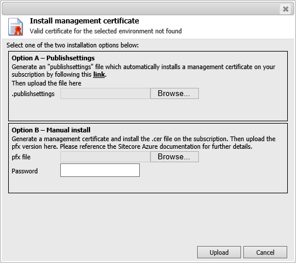

#Error installing a management certificate for Sitecore Azure without the appropriate application pool permissions

The Sitecore Azure module is based on the Microsoft Azure [Service Management REST API](https://msdn.microsoft.com/en-us/library/azure/ee460799.aspx). All API operations are performed over SSL and are mutually authenticated using the X.509 v4 certificate. Therefore, a management certificate must be uploaded to the module.

The Sitecore Azure module provides two ways for uploading certificates:

- The first way (Option A) uses Microsoft Azure Publishing Settings (`*.publishsettings` file), which can be generated using the [Microsoft Azure Management Portal](https://manage.windowsazure.com/publishsettings/index).

- The second way (Option B) requires manually generating the management certificate, then uploading a public key (`*.cer` file) to the Azure Certificate Store, and a private key (`*.pfx` file) to the Sitecore Azure module.



##Problem

Sitecore Azure may sometimes throw the following error after clicking the **Upload** button. This may happen when the **ApplicationPoolIdentity** is used for running Sitecore’s Application Pool and Option A is used for uploading a `*.publishsettings` file.

An example of the exception and its stack trace is:

```
ERROR Sitecore.Azure The system cannot find the file specified. 
Exception: System.Security.Cryptography.CryptographicException 
Message: The system cannot find the file specified. 
Source: mscorlib 
  at System.Security.Cryptography.CryptographicException.ThrowCryptographicException(Int32 hr) 
  at System.Security.Cryptography.X509Certificates.X509Utils._LoadCertFromBlob(Byte[] rawData, IntPtr password, UInt32 dwFlags, Boolean persistKeySet, SafeCertContextHandle& pCertCtx) 
  at System.Security.Cryptography.X509Certificates.X509Certificate.LoadCertificateFromBlob(Byte[] rawData, Object password, X509KeyStorageFlags keyStorageFlags) 
  at Sitecore.Azure.Managers.CertificateManager.GetCertificate(String base64string, String password) 
  at Sitecore.Azure.UI.Shell.Applications.Azure.AzureControls.Dialogs.UploadCertificateBase.TryInstallCertificate(String certificateString, String password, Exception& exception, X509Certificate2& certificate)
```

##Solution

Perform the following steps to solve the issue with uploading the Azure Publishing Settings file:

1. In the **Internet Information Services (IIS) Manager** application, modify the relevant Application Pool using the **Advanced Settings** command.

2. In the **Advanced Settings** dialog box, set the **Load User Profile** setting to the **True** value.

3. In the **Sitecore Desktop**, run the **Sitecore Azure** application and upload the **Azure Publishing Settings** file.