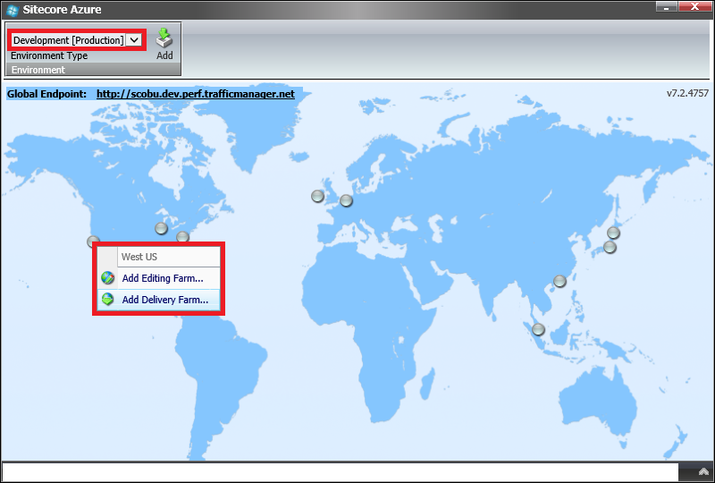

#How to add a custom connection string in Sitecore Azure

The Sitecore Azure module modifies the `connectionStrings` element in the web.config file during the deployment to the [Microsoft Azure SQL Databases Service](https://msdn.microsoft.com/en-us/library/azure/ee336279.aspx) databases.

This article provides a list of techniques that can be used to manually add a custom connection string to a new or existing Azure deployment.

##Solution

The recommended approach to adding a custom connection string in Sitecore Azure is as follows:

1. Log in to the **Sitecore Client** and open the **Sitecore Azure** application.

2. Select either the **Staging** or **Production** slot and click a data center to add an **Editing** or **Delivery Farm**.

   

3. In the **New Deployment** dialog box, click the **More Options** button. The **Content Editor** with the preselected **Azure Deployment** item appears.

   

4. In the **Config Patches** section, in the **Connection String Patch** field, add a custom connection string:

   ```xml
   <xsl:stylesheet>    
   ...
     <xsl:template match="/connectionStrings">
       <connectionStrings>     
       ...
         <add name="security" connectionString="Data Source=tcp:ypm2rdc26v.database.windows.net;Initial Catalog=Sitecore_Security;Integrated Security=False;User ID=sitecore@ypm2rdc26v;Password=w3EYq47QZLGj;Encrypt=True" />
       ...
       </connectionStrings>
     </xsl:template>
   </xsl:stylesheet>
   ```
   
5. Save the changes and close the **Content Editor** application.

6. In the **New Deployment** dialog box, click the **Start Deployment** button.

   