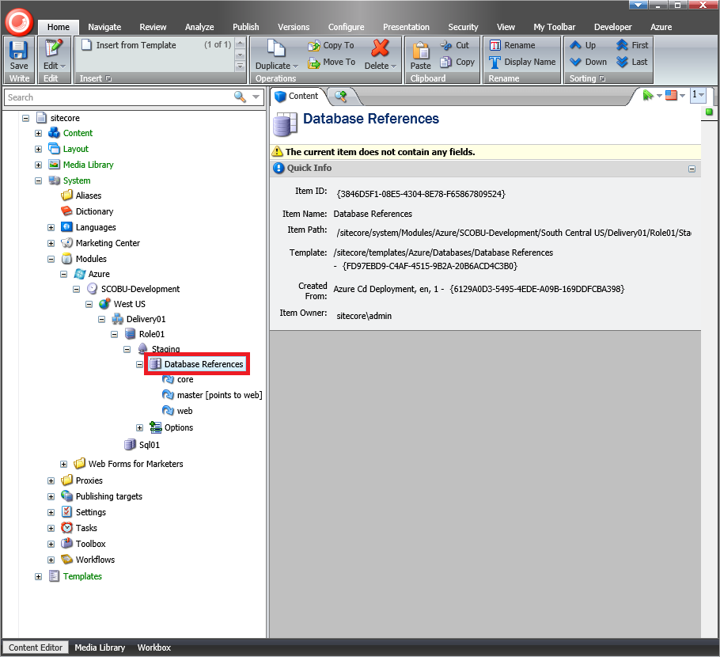
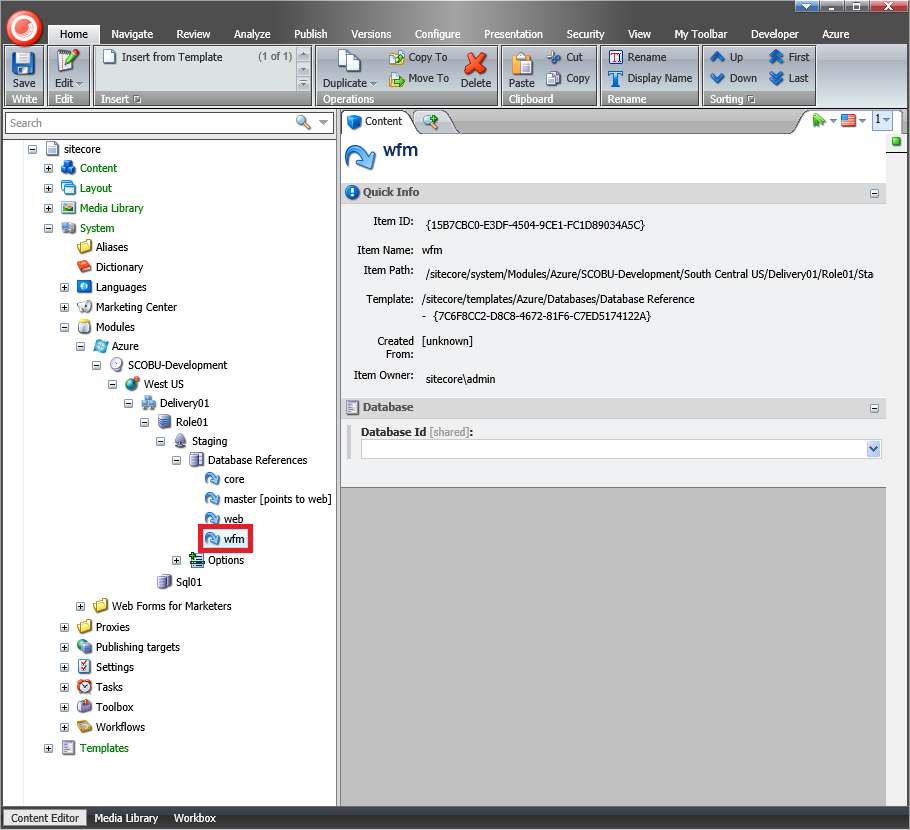

#How to add a custom database in Sitecore Azure

The Sitecore Azure module automatically creates the [Microsoft Azure SQL Databases Service](https://msdn.microsoft.com/en-us/library/azure/ee336279.aspx) and deploys the default Sitecore Core, Master and Web databases during deployment.

This article provides a list of techniques that can be used to manually add a custom database to a new deployment using the Sitecore Azure module.

##Solution

The recommended approach to add a custom database in Sitecore Azure is as follows:

1. Log in to the **Sitecore Client** and open the **Sitecore Azure** application.
  
2. Select either the **Staging** or **Production** slot and click on a data center to add an **Editing** or **Delivery Farm**.

   

3. In the **New Deployment** dialog, click the **More Options** button. The **Content Editor** with a preselected `Azure Deployment` item appears.
  
   

4. Select the `/sitecore/system/Modules/Azure/<Environment>/<Location>/<Farm>/<WebRole>/<Azure Deployment>/Database References` item.

   

5. Insert a new item based on the `/sitecore/templates/Azure/Databases/Database Reference` template, using `wfm` as the item name. The **Database Id** field must be kept as an empty.

   

   > **Important:** the item name must match the connection string name.

   > **Note:** In the `\App_Config\ConnectionStrings.config` file, the connection string to the Sitecore Web Forms for Marketers database is as follows:
   
   ```xml
   <connectionStrings>
   ...
     <add name="wfm" connectionString="Data Source=.\SQLEXPRESS2014;Initial Catalog=Sitecore_WFM;Integrated Security=False;User ID=sa;Password=12345" />
   ...
   </connectionStrings>
   ```

6. Save the changes and close the **Content Editor** application.

7. In the **New Deployment** dialog, click the **Start Deployment** button.

   