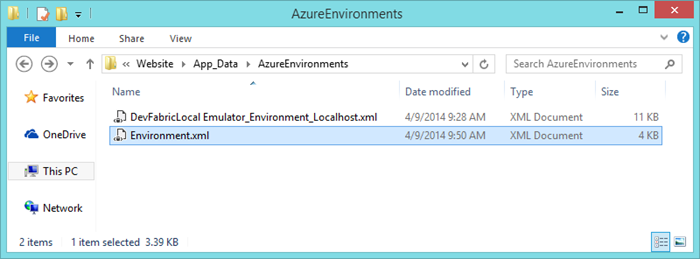

#How to add a new Sitecore Azure environment file

Sitecore Azure may sometimes show the following error after adding a new environment file from the Sitecore Azure application that has the same name as a previously added environment file. This may also prevent further deployment operations from running.

An example of the error stack trace:

```
Failed to initialize environment file Environment.xml 
System.InvalidOperationException: There is an error in XML document (32, 26). ---> System.Xml.XmlException: Data at the root level is invalid. Line 32, position 26. 
  at System.Xml.XmlTextReaderImpl.Throw(String res, String arg) 
  at System.Xml.XmlTextReaderImpl.ParseRootLevelWhitespace() 
  at System.Xml.XmlTextReaderImpl.ParseDocumentContent() 
  at System.Xml.XmlReader.ReadEndElement() 
  at Microsoft.Xml.Serialization.GeneratedAssembly.XmlSerializationReaderEnvironmentDataStorage.Read2_EnvironmentDataStorage(Boolean isNullable, Boolean checkType) 
  at Microsoft.Xml.Serialization.GeneratedAssembly.XmlSerializationReaderEnvironmentDataStorage.Read3_EnvironmentDataStorage() 
 
--- End of inner exception stack trace --- 
  
  at System.Xml.Serialization.XmlSerializer.Deserialize(XmlReader xmlReader, String encodingStyle, XmlDeserializationEvents events) 
  at Sitecore.Azure.Configuration.Environments.EnvironmentDefinition.GetEnvironmentDataStorage(String filePath) 
  at Sitecore.Azure.Configuration.Environments.EnvironmentDefinition..ctor(String filePath) 
  at Sitecore.Azure.Configuration.Environments.EnvironmentDefinitions.Initialize()
```

OR

```
ERROR Sitecore.Azure Failed to initialize environment file Environment.xml 
Exception: System.InvalidOperationException 
Message: There is an error in XML document (32, 26). 
Source: System.Xml 
  at System.Xml.Serialization.XmlSerializer.Deserialize(XmlReader xmlReader, String encodingStyle, XmlDeserializationEvents events) 
  at Sitecore.Azure.Configuration.Environments.EnvironmentDefinition.GetEnvironmentDataStorage(String filePath) 
  at Sitecore.Azure.Configuration.Environments.EnvironmentDefinition..ctor(String filePath) 
  at Sitecore.Azure.Configuration.Environments.EnvironmentDefinitions.Initialize() 
 
Nested Exception 
 
Exception: System.Xml.XmlException 
Message: Data at the root level is invalid. Line 32, position 26. 
Source: System.Xml 
  at System.Xml.XmlTextReaderImpl.Throw(String res, String arg) 
  at System.Xml.XmlTextReaderImpl.ParseRootLevelWhitespace() 
  at System.Xml.XmlTextReaderImpl.ParseDocumentContent() 
  at System.Xml.XmlReader.ReadEndElement() 
  at Microsoft.Xml.Serialization.GeneratedAssembly.XmlSerializationReaderEnvironmentDataStorage.Read2_EnvironmentDataStorage(Boolean isNullable, Boolean checkType) 
  at Microsoft.Xml.Serialization.GeneratedAssembly.XmlSerializationReaderEnvironmentDataStorage.Read3_EnvironmentDataStorage()
```

##Solution

The recommended approach to add a new Sitecore Azure environment file is as follows:

1. Delete an old Environment file in the `/Website/App_Data/AzureEnvironments` directory.

   
 
   > **Note:** the path to the folder is configured by the `Azure.EnvironmentsPath` setting in the `/Website/App_Config/Include/Sitecore.Azure.config` file.

2. Recycle Sitecore Application Pool or reset the Internet Information Services (IIS).

3. In the **Sitecore Azure** application, add a new environment file.

To make a previous deployment use the new Sitecore Azure environment file, perform the following steps:

1. In the **Content Editor**, modify the `/sitecore/system/Modules/Azure/<Environment>` item.

2. In the **Environment Id** field, put the value of the `EnvironmentId` element from the new Environment file and save changes.

3. Recycle Sitecore Application Pool or reset the Internet Information Services (IIS).

> **Important:** Since the Sitecore License file is associated with every Sitecore Azure environment file, you must update Sitecore License for your Sitecore solution as well.