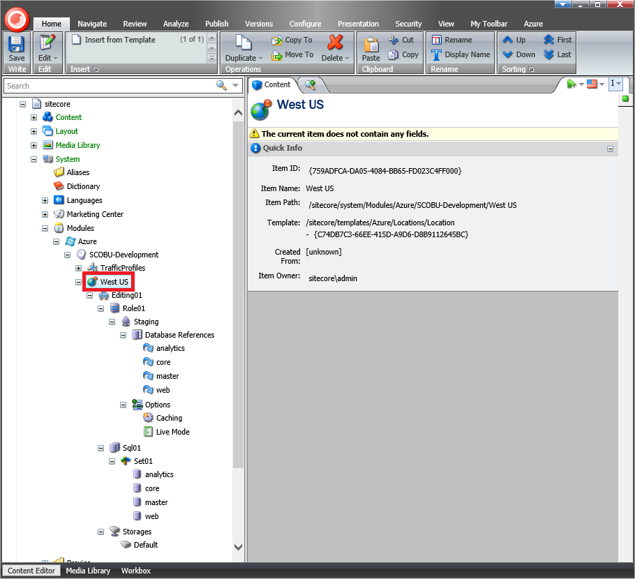
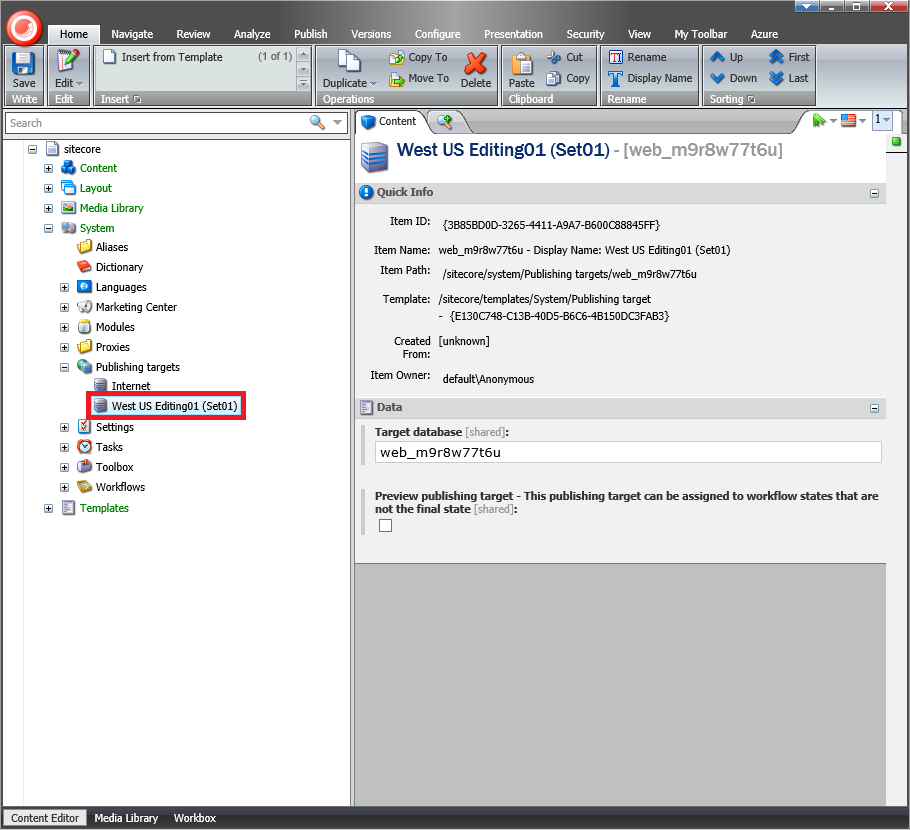
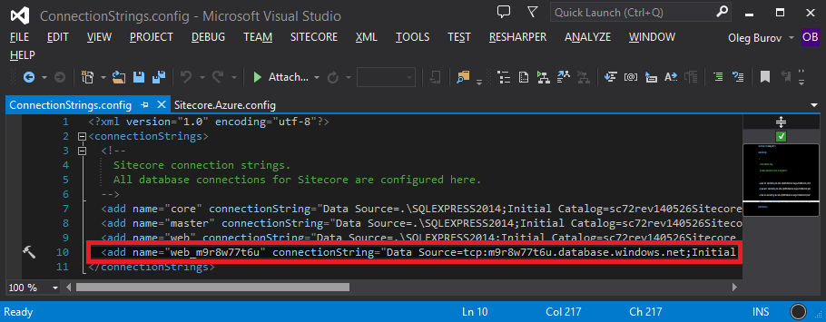
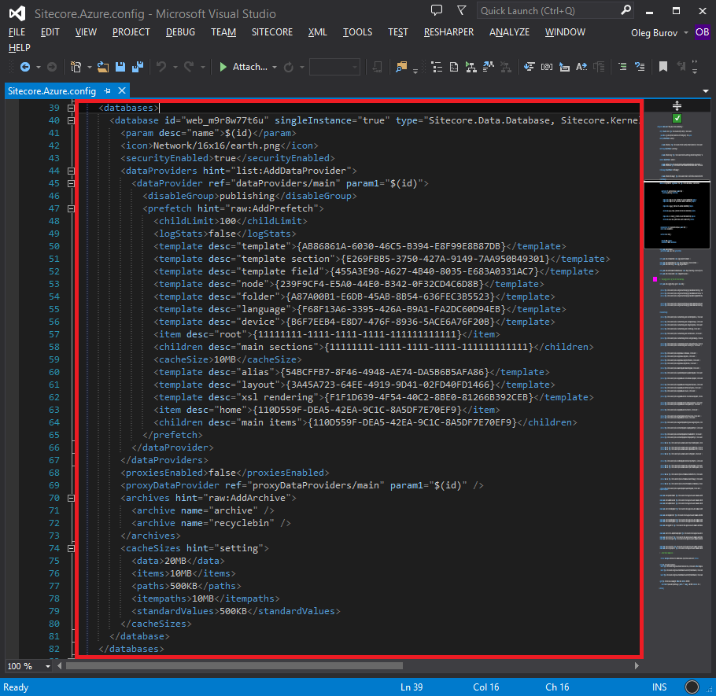
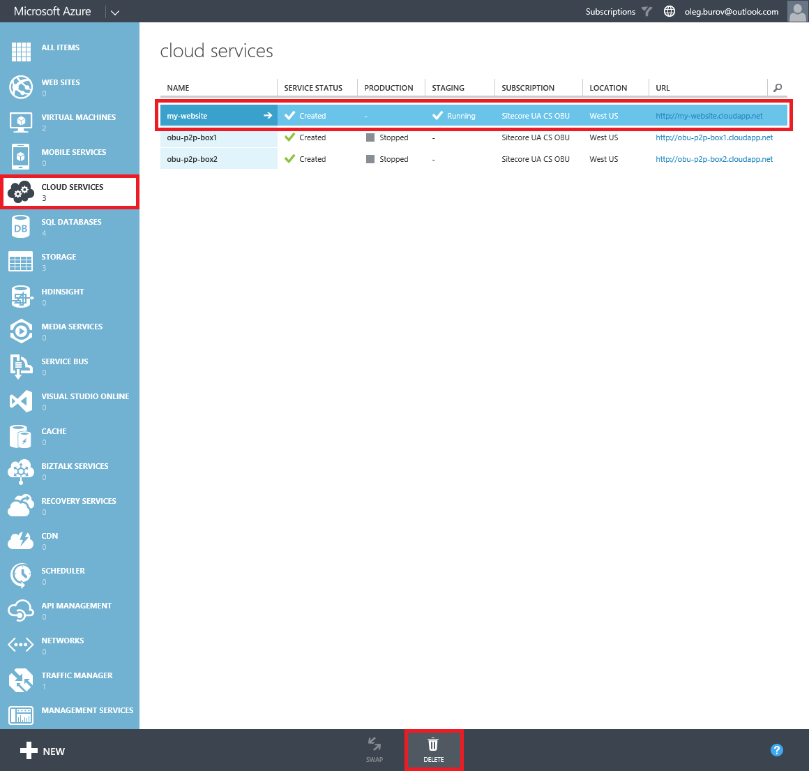
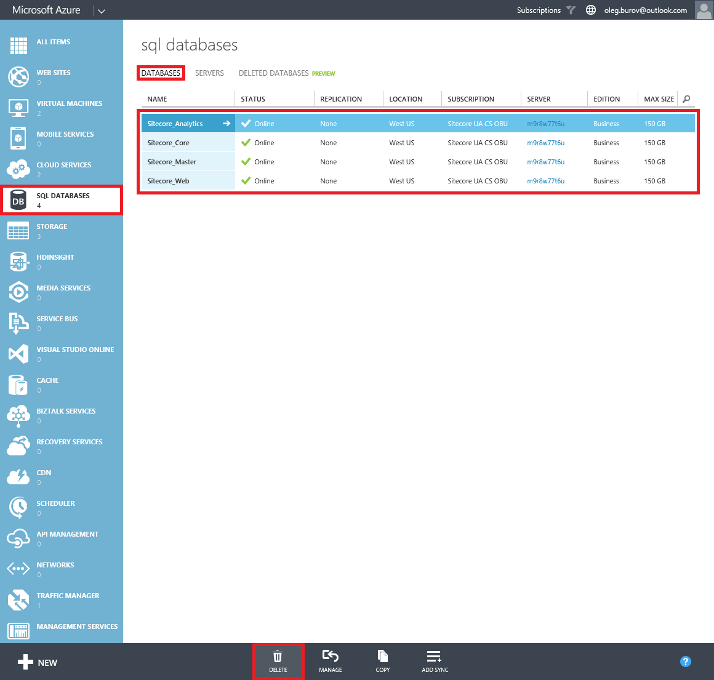
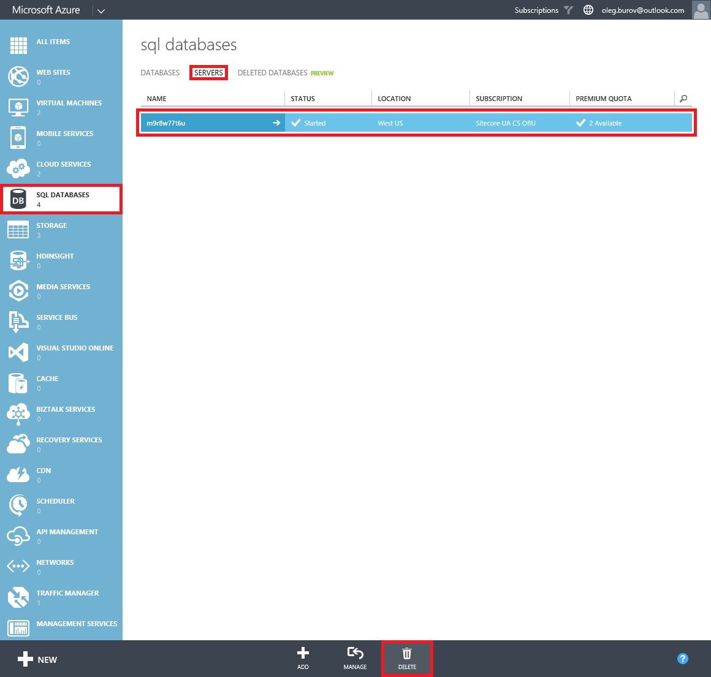
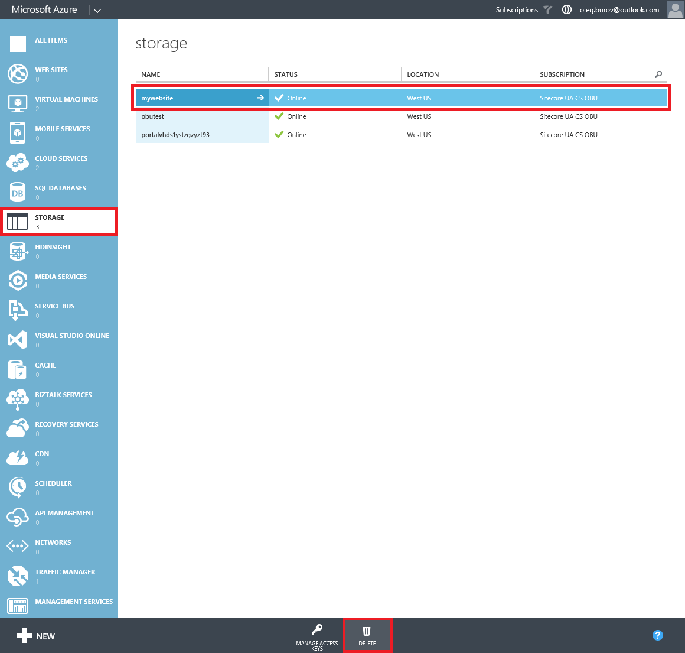
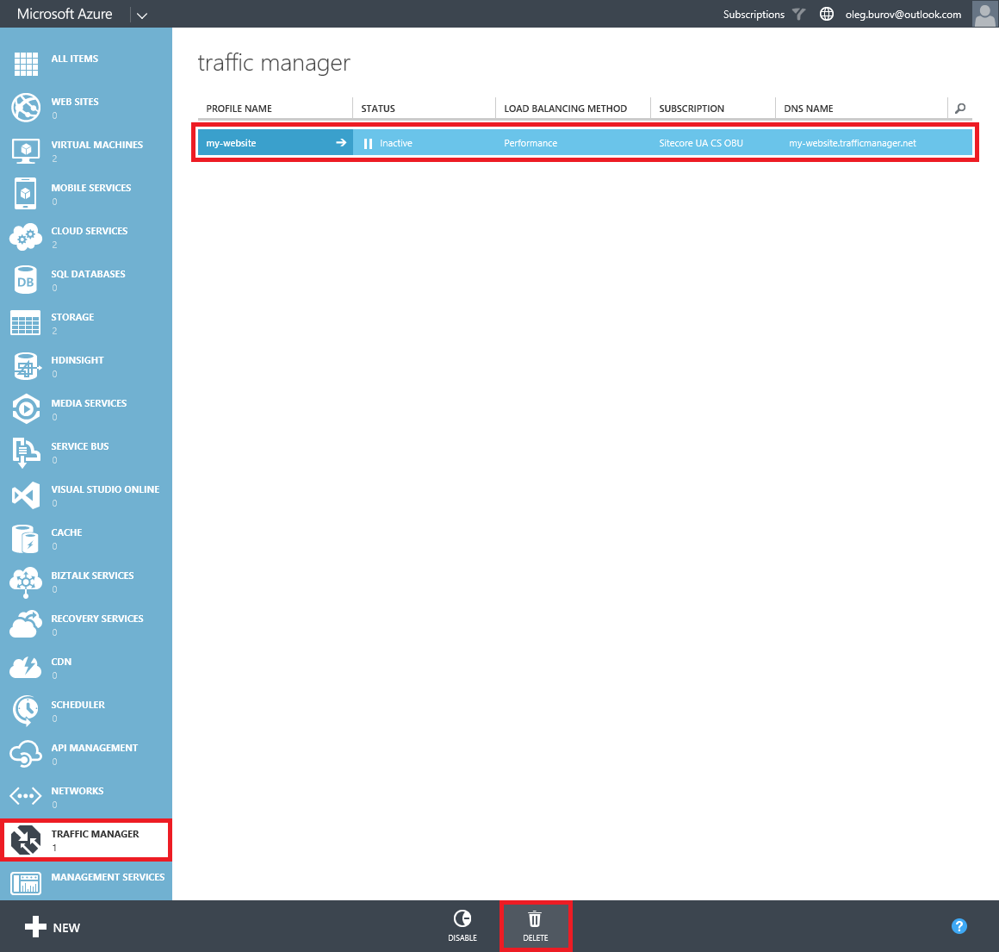
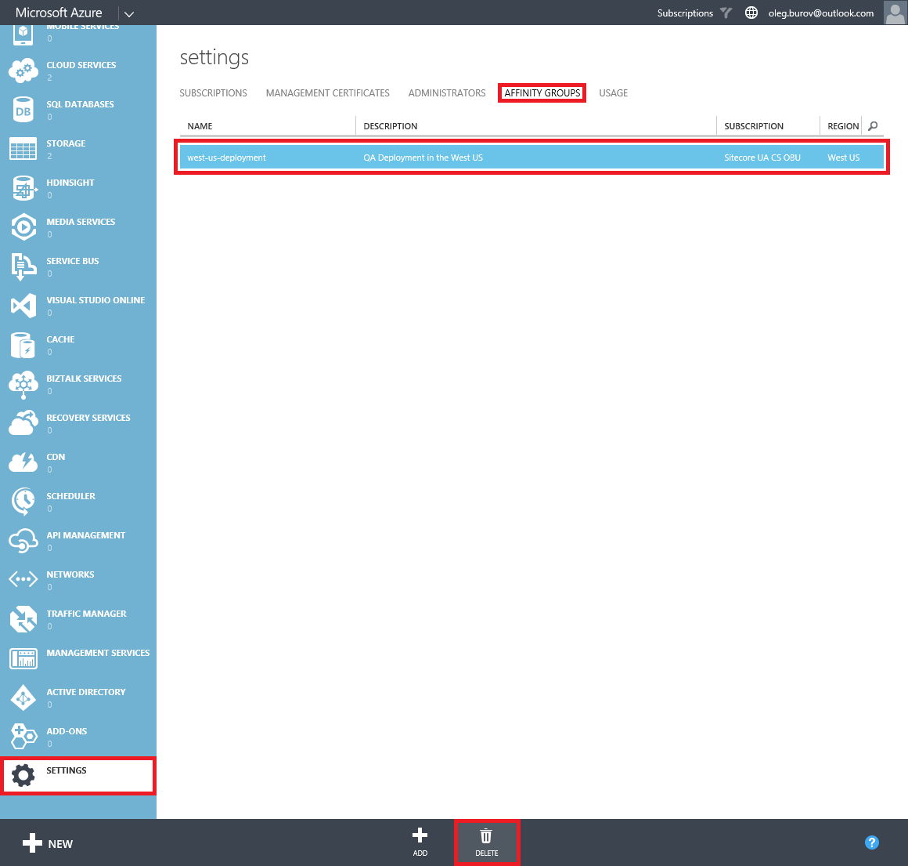

#How to clean up a failed Sitecore Azure deployment

The Sitecore Azure module automates the deployment process of a Sitecore solution to [Microsoft Azure](http://azure.microsoft.com/) cloud platform using the PaaS model. It keeps all routine work and many steps involved into the process behind the scenes.

However, a deployment may sometimes fail due to various reasons, such as network problems, web application restarts, etc. At the moment, the module does not provide an ability to clean up a failed deployment.

This article provides a list of techniques that can be used to clean up a failed Sitecore Azure deployment when not all of the deployment steps have been successfully completed.

##Solution

The recommended approach to clean up a failed deployment is as follows:

1. In the **Content Editor**, delete the `/sitecore/system/Modules/Azure/<Enviroment>/<Location>` item with its sub-items that represent a deployment.

   

2. In the **Content Editor**, delete the `/sitecore/system/Publishing targets/<Publishing target>` item that represents the `Web` database in the Microsoft Azure environment.

   

3. Modify the `\Website\App_Config\ConnectionStrings.config` file under the `connectionStrings` element. Delete a connection string that belongs to the `Web` database in the Microsoft Azure SQL Databases.

   

4. Modify the `\Website\App_Config\Include\Sitecore.Azure.config` file under the `\configuration\sitecore\databases` element. Delete a database definition that represents the `Web` database in the Microsoft Azure SQL Databases.
   
   

5. Log in to the **Microsoft Azure Management Portal** using the https://manage.windowsazure.com URL.

6. In the **Cloud Services** section, select a cloud service that represents the Sitecore deployment and click the **Delete** button in the ribbon at the bottom. Select the **Delete entire cloud service** option and click **Yes** to continue deleting operation.

   

7. In the **SQL Databases** section, one by one select SQL database that represents the `Core`, `Master`, `Web` and Analytics databases and click the **Delete** button in the ribbon. Select **Yes, Delete** to continue the deletion operation.

   

   **Note:** By default, there are the `Core` and `Web` databases for the **Delivery Farm** and the `Core`, `Master` and `Web` databases for the **Editing Farm**. Additionally, if Sitecore DMS is enabled, there is the Analytics database for both the Delivery Farm and Editing Farm.

   As an option, you can delete the entire SQL Server instance, if there are only Sitecore databases that belong to the deployment. In the **SQL Databases** section, switch to the **Servers** tab and select a server. Click the **Delete** button in the ribbon. Enter the server name to confirm the deletion.

   

8. In the **Storage** section, select a storage account and click the **Delete** button in the ribbon. Select **Yes** to continue the deletion operation.

   

9. \[Optional\] In the **Traffic Manager** section, select a traffic manager profile and click the **Delete** button in the ribbon. Select Yes to continue the deletion operation.

   

10. \[Optional\] In the **Settings** section, switch to the **Affinity Groups** tab and select an affinity group. Click the **Delete** button in the ribbon. Select **Yes** to continue the deletion operation.

   

   **Note:** Steps 9 and 10 are optional since there might be other deployments that belong to the same traffic manager profile and affinity group. Therefore, you should not delete them.