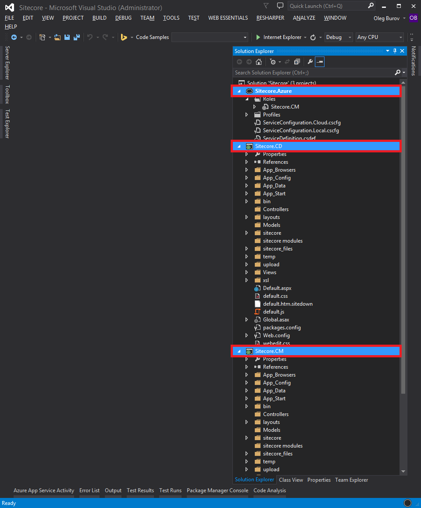
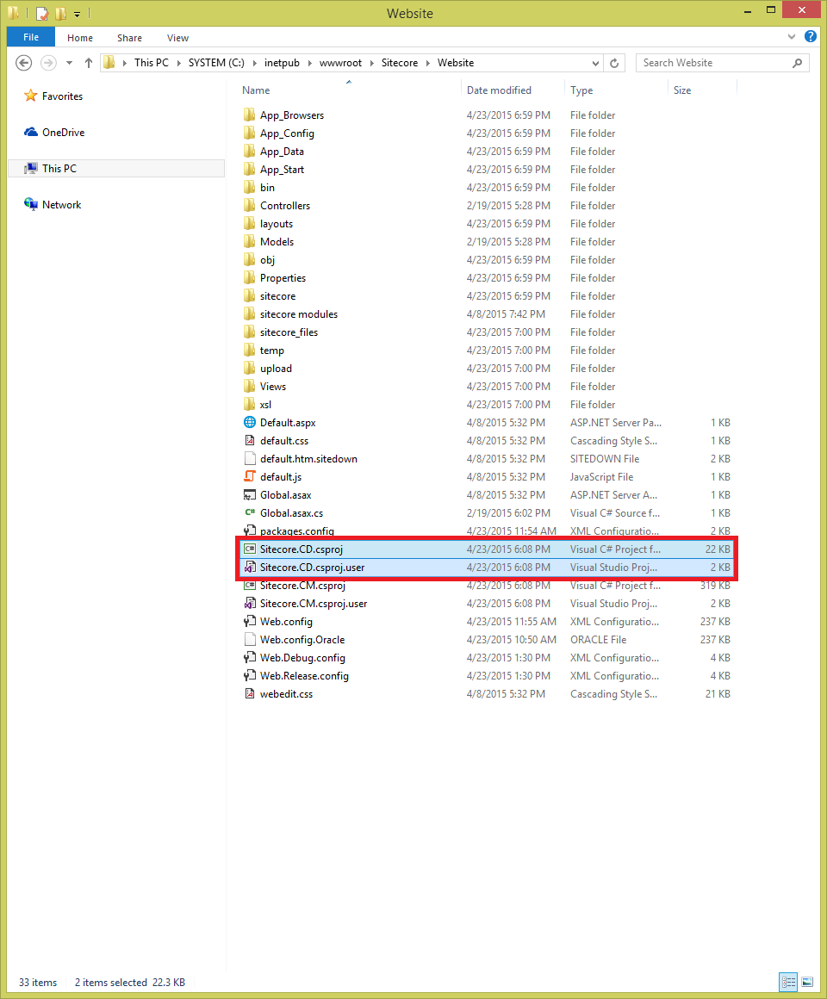

#How to configure Microsoft Azure deployment for a standard multi-instance Sitecore 7.2 solution using Visual Studio

Sitecore supports distributed solutions that include multiple Sitecore instances in both the Content Management (CM) and Content Delivery (CD) environments.

This article provides a list of techniques that can be used to configure Microsoft Azure deployment for a standard multi-instance Sitecore 7.2 solution using Microsoft Visual Studio.

**Important:** It is highly recommended that you get acquainted with the [Compute Hosting Options Provided by Azure](http://azure.microsoft.com/en-us/documentation/articles/fundamentals-application-models/) and [Microsoft Azure Fundamentals](http://www.microsoftvirtualacademy.com/colleges/Azure-fundamentals) before following the instructions in this article.

**Requirements:**
- A work or school account / Microsoft account and a Microsoft Azure subscription with the following Azure services enabled:
  - [Azure Cloud Service](https://msdn.microsoft.com/en-us/library/azure/jj155995.aspx)
  - [Azure Storage](https://msdn.microsoft.com/en-us/library/azure/gg433040.aspx)
  - [Azure SQL Database](https://msdn.microsoft.com/en-us/library/azure/ee336279.aspx)
  - [Azure Redis Cache](https://msdn.microsoft.com/en-us/library/azure/dn690523.aspx)
- Microsoft Visual Studio 2013
- Microsoft Azure SDK 2.5.1 for .NET
- Microsoft Azure Tool for Visual Studio 2013 
- Microsoft SQL Server Management Studio 2014
- Sitecore CMS and DMS 7.2 rev. 150408 (7.2 Update-4) or higher

**Note:** To download the latest version of the Microsoft Azure SDK and Tool for Visual Studio, follow this link: http://azure.microsoft.com/en-us/downloads/

##Solution

The recommended approach to configuring multi-instance CM and CD deployments using Visual Studio is as follows:

1. In the **Visual Studio**, configure the Sitecore solution as described in the [How to deploy Sitecore 7.2 solution to Microsoft Azure Cloud Service using Visual Studio](how-to-deploy-sitecore-72-solution-to-microsoft-azure-cloud-service-using-visual-studio.md) article.

   **Note:** Use the following names:
   - For the **ASP.NET Web Application** project – `Sitecore.CD`
   - For the **Azure Cloud Service** project – `Sitecore.Azure`
  
   

2. In the file system, duplicate both the `Sitecore.CD.csproj` and `Sitecore.CD.csproj.user` files using the `Sitecore.CM.csproj` and `Sitecore.CM.csproj` names.

   **Important:** Both the `Sitecore.CM` and `Sitecore.CD` ASP.NET Web Application projects must be located in the same `\Website` directory to share the same Sitecore directories and files.

   

3. In the **Visual Studio**, in the **Solution Explorer**, right-click the solution. Then click the **Add** -> **Existing project...** in the context menu. Add the duplicated `Sitecore.CM` projects to the same Visual Studio solution.

   

4. In the **Visual Studio**, in the **Solution Explorer**, include the following Sitecore Content Management related directories in the `Sitecore.CM` project:
   
   - \sitecore\admin
   - \sitecore\Copyright
   - \sitecore\debug
   - \sitecore\images
   - \sitecore\login
   - \sitecore\portal
   - \sitecore\samples
   - \sitecore\shell
   - \sitecore\blocked.aspx
   - \sitecore\default.aspx
   - \sitecore\no.css

5. In the **Visual Studio**, in the **Solution Explorer**, under the **Azure Cloud Service** project, right-click the `Roles` item. Then click the **Add** -> **Web Role Project in solution...** in the context menu. The **Associate with Role Project** dialog box appears.

   

6. In the **Associate with Role Project** dialog box, select the `Sitecore.CM` project and add it as the second Web Role to the **Azure Cloud Service** project.

   

7. Configure the `Sitecore.CD` and `Sitecore.CM` projects according to the [Sitecore Scaling Guide](http://sdn.sitecore.net/Reference/Sitecore%207/Scaling%20Guide.aspx) document. Each project must include the following configuration files in the `\App_Config\Include` folder. 
   
   For the `Sitecore.CD` project:
   
   - ScalabilitySettings.config
   - SwitchMasterToWeb.config
   
   For the `Sitecore.CM` project:

   - ScalabilitySettings.config

8. Right-click the `Sitecore.Azure` project, and then click the **Publish...** in the context menu to deploy both the Sitecore Content Management and Content Delivery WebRoles.

   