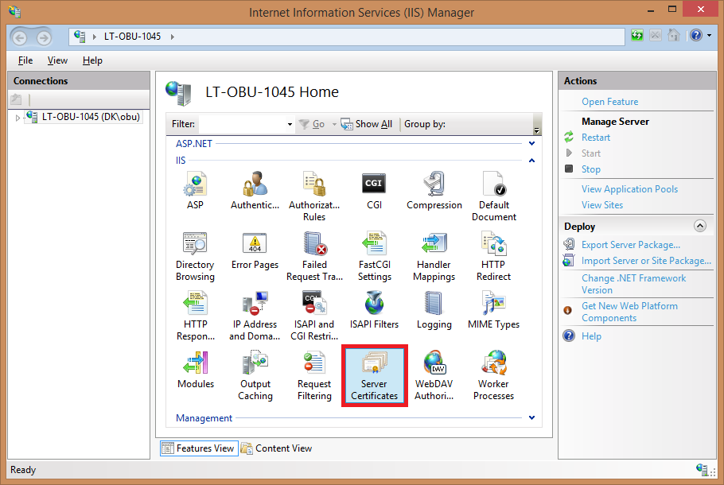
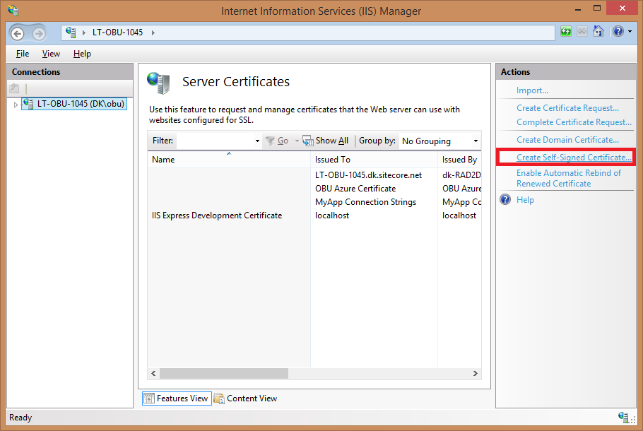
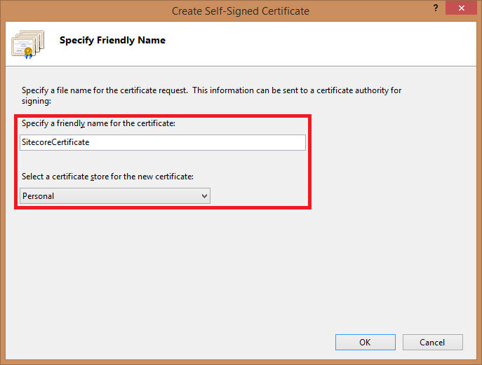
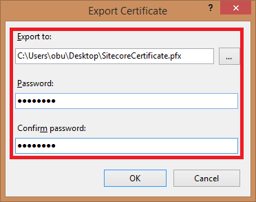
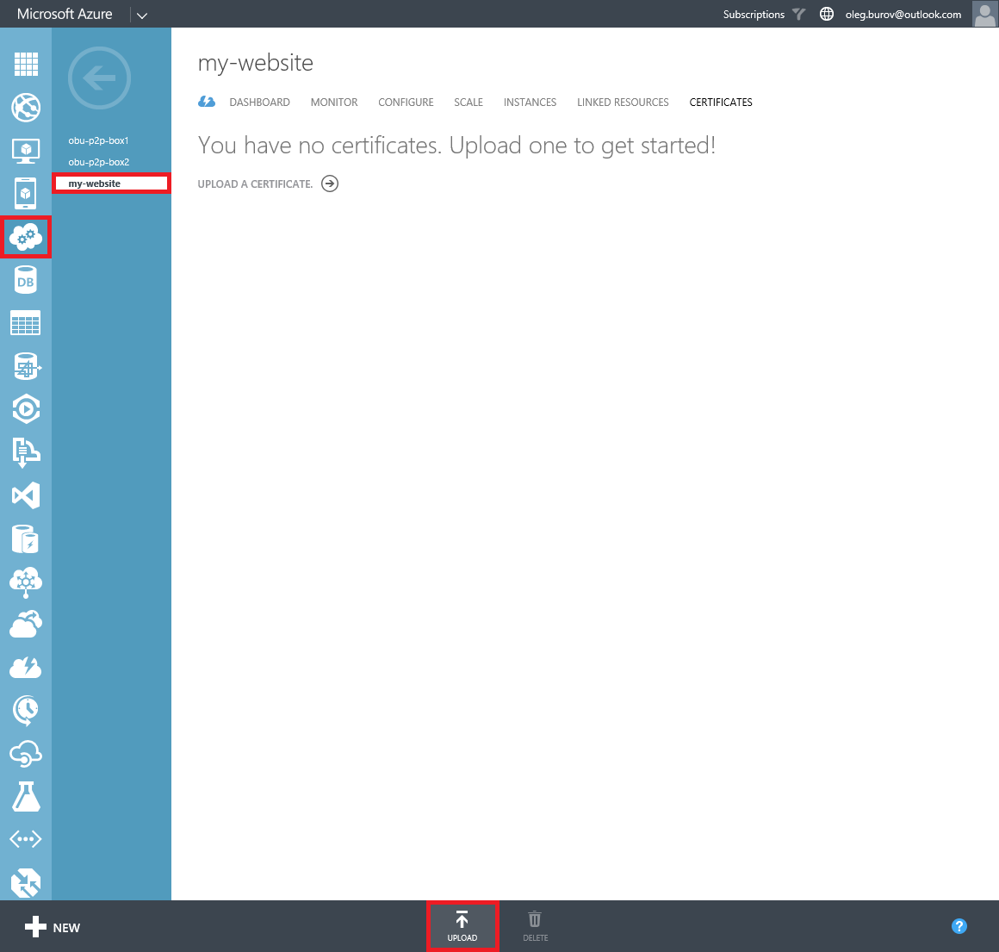
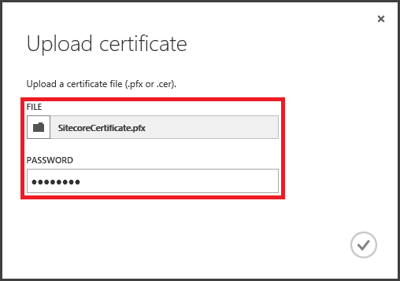
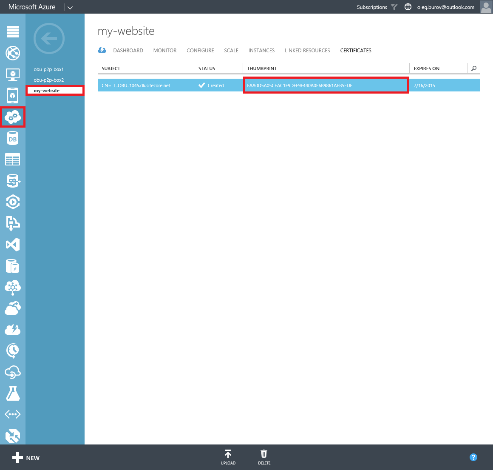

#How to configure SSL in Sitecore Azure

Sitecore CMS supports configuration of the Secure Socket Layer (SSL) encryption to secure the data sent across the internet.

The current article provides a list of techniques that can be used to manually create a self-signed SSL certificate, upload it to Azure Cloud Service, and configure an HTTPS (SSL) endpoint for a Sitecore solution when using the Sitecore Azure module.

> **Note:** For the basic information about configuring SSL for an application in Azure, see Microsoft Azure website: 
https://azure.microsoft.com/en-us/documentation/articles/cloud-services-configure-ssl-certificate/

#Solution

The recommended approach to configure SSL in Sitecore Azure is as follows:

1. Run the **Internet Information Services (IIS)** and double-click on the **Server Certificates** feature.

   

2. In the **Actions** section, click the **Create Self-Signed Certificate**.

   
   
3. In the **Specify Friendly Name** dialog, fill a certificate name and click **OK** button.

   
   
4. Right-click on the created certificate and select **Export...** menu.

   
   
5. In the **Export Certificate** dialog, set a path for the `*.pfx` file (private key) and fill the **Password** fields.

   
   
6. Log in to the **Microsoft Azure Management Portal** using the https://manage.windowsazure.com URL.
   
7. In the **Cloud Service** section, select a cloud service entry that represents the Sitecore solution or create a custom Cloud Service.

   
   
   > **Note:** For more details about using a custom Azure Cloud Service in Sitecore Azure, see the [How to use a custom Azure Cloud Service in Sitecore Azure](how-to-use-a-custom-azure-cloud-service-in-sitecore-azure.md) article.
   
8. Switch to the **Certificates** tab and click the **Upload** button.

   
   
9. In the **Upload Certificate** dialog, select the saved `*.pfx` file and fill the **Password** field.

   
   
10. Copy a thumbprint of the uploaded certificates.

   
   
11. Log in to the **Sitecore Client** and open the **Sitecore Azure** application.

12. Select either the **Staging** or **Production** slot and click on a data center to add an **Editing** or **Delivery Farm**.

   
   
13. In the **New Deployment** dialog, click the **More Options** button. The **Content Editor** with a pre-selected `Azure Deployment` item appears.

   
   
14. In the **CS Pack** section, in the **Service Definition** field, add the following elements:

   ```xml
   <WebRole name="SitecoreWebRole" enableNativeCodeExecution="false" vmsize="Medium">
   ...
     <Endpoints>
     ...
       <InputEndpoint name="HttpsIn" protocol="https" port="443" certificate="SitecoreCertificate" />
     </Endpoints>
     <Sites>
       <Site name="SitecoreWebSite" physicalDirectory=".\SitecoreWebSite">
         <Bindings>       
         ...
           <Binding name="HttpsIn" endpointName="HttpsIn" />      
         </Bindings>
       </Site>
     </Sites>
     <Certificates>
       <Certificate name="SitecoreCertificate" 
                    storeLocation="LocalMachine" 
                    storeName="Personal" />
     </Certificates>
   ...
   </WebRole>
   ```
15. In the **CS Pack** section, in the **Service Configuration** field, add the following element:

   ```xml
   <Role name="SitecoreWebRole">
   ...
     <Certificates>
       <Certificate name="SitecoreCertificate" 
                    thumbprint="FAA0D5A05CEAC1E9DFF9F440A0E6B9861AEB5EDF" 
                    thumbprintAlgorithm="sha1" />
     </Certificates>
   ...
   </Role>
   ``` 
   
   > **Note:** use the copied thumbprint value in the `Certificates` element.
   
16. In the **Hosted Service** section, in the **DNS Host Name** field, set the **Cloud Service** with uploaded certificate (`*.pfx` file) in the **Microsoft Azure Management Portal**.

   
   
   > **Important:** if you create a custom Cloud Service, you must create a custom Storage Service, too.
         
   > **Note:** For more details about using a custom Azure Storage Service in Sitecore Azure, see the [How to use a custom Azure Storage Service in Sitecore Azure](how-to-use-a-custom-azure-storage-service-in-sitecore-azure.md) article.

17. Save changes and close the **Content Editor** application.

18. In the **New Deployment** dialog, click the **Start Deployment** button.

   