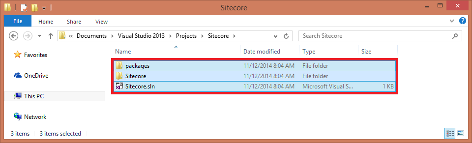
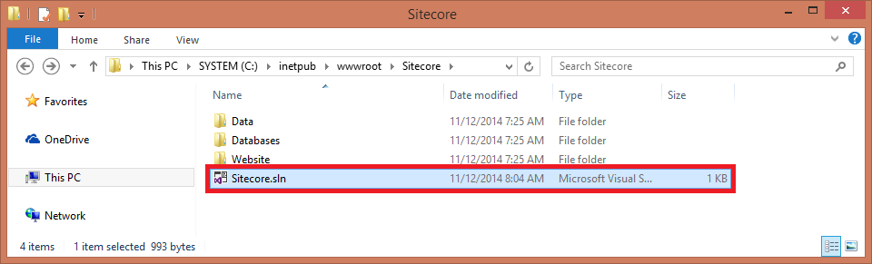
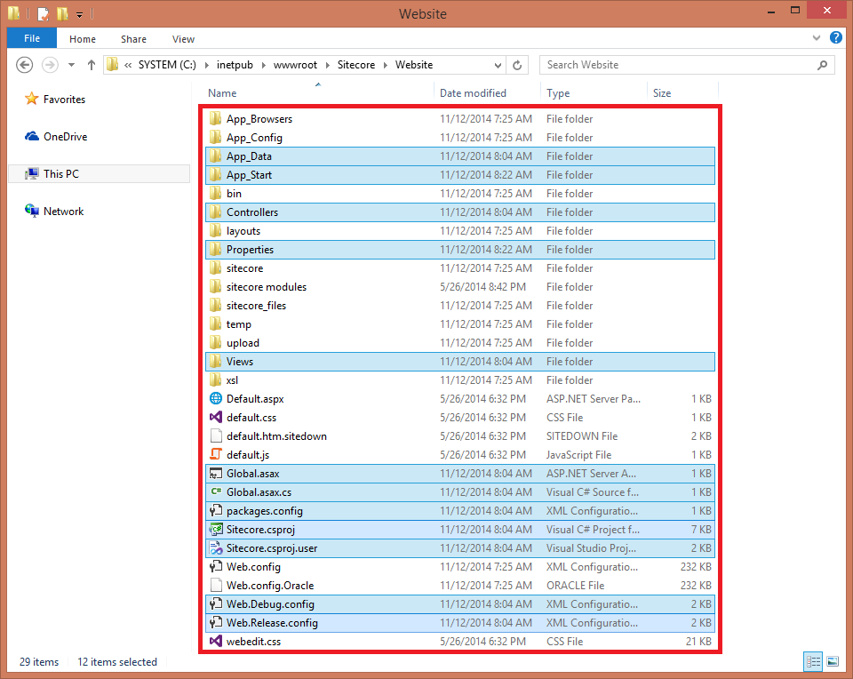

# How to create ASP.NET Web Application project

Sitecore supports the Visual Studio ASP.NET project model for Sitecore solutions using both the ASP.NET Web Forms and ASP.NET MVC applications. 

## Solution

The recommended approach to create an ASP.NET project in Visual Studio for Sitecore solution is as follows:

1. In the **Visual Studio**, on the ribbon, click File, and then select **New -> Project...** in the context menu. The **New Project** dialog box appears.

   

2. In the **New Project** dialog box, in the left panel, select the `/Installed/Templates/Visual C#/Web` item, and then select the **ASP.NET Web Application** template.

   

3. Fill in the **Name**, **Location** and **Solution** name fields and click the **OK** button. The **New ASP.NET Project** dialog box appears.

   

4. In the **New ASP.NET Project** dialog box, select the **Empty** template and select one of the following options, and then click the **OK** button:
   - **Web Forms** to build an ASP.NET Web Forms application
   - **MVC** to build an ASP.NET MVC application
   - Both **Web Forms** and **MVC** to build a hybrid ASP.NET application

   

5. Close the **Visual Studio** when the project is generated.

   

6. In the file system, go to the project location.

   

7. Copy the `Sitecore.sln` file to the `\<SitecoreSolutionRoot>` directory, where the `\Data`, `\Databases` and `\Website` ones are located.

   

8. Modify the `Sitecore.sln` file to change the path to `Sitecore.csproj` file to the `\Website` directory.
   
   ```xml
   Project("{FAE04EC0-301F-11D3-BF4B-00C04F79EFBC}") = "Sitecore", "Website\Sitecore.csproj", "{4B02E1CD-9DEE-47D2-B7C7-DBDC6AE2A329}"
   ```
9. Copy the following directories and files to the `\Website` directory.

   For an **ASP.NET Web Forms** application:
   - \App_Data
   - \Models
   - \Properties
   - \Global.asax
   - \Global.asax.cs
   - \Sitecore.csproj
   - \Sitecore.csproj.user
   - \Web.Debug.config
   - \Web.Release.config
  
   
  
   For an **ASP.NET MVC** application:
   - \App_Data
   - \App_Start
   - \Controllers
   - \Models
   - \Properties
   - \Views
   - \Global.asax
   - \Globalasax.cs
   - \packages.config
   - \Sitecore.cspro
   - \Sitecore.csproj.user
   - \Web.Debug.config
   - \Web.Release.config

   
   
   > **Important:** Modify both the `packages.config` and `\Views\Web.config` files to use the same version of ASP.NET MVC that Sitecore CMS supports. For example, for Sitecore CMS 7.2, 7.5 and 8.0 that support ASP.NET MVC 5.1, the version must be 5.1.0:
   
   ```xml
   <packages>
     <package id="Microsoft.AspNet.Mvc" version="5.1.0" targetFramework="net45" />
     <package id="Microsoft.AspNet.Razor" version="3.1.0" targetFramework="net45" />
     <package id="Microsoft.AspNet.WebPages" version="3.1.0" targetFramework="net45" />
     <package id="Microsoft.Web.Infrastructure" version="1.0.0.0" targetFramework="net45" />
   </packages>
   ```
   
   ```xml
   <configuration>
   ...
     <system.web.webPages.razor>
       <host factoryType="System.Web.Mvc.MvcWebRazorHostFactory, System.Web.Mvc, Version=5.1.0.0, Culture=neutral, PublicKeyToken=31BF3856AD364E35" />
       ...
     </system.web.webPages.razor>
   ...
   </configuration>
   ```

10. In the **Visual Studio**, open the `\<SitecoreSolutionRoot>\Sitecore.sln` solution.

   

11. In the **Solution Explorer**, add a reference to the `Sitecore.Kernel.dll` assembly and set the **Copy Local** property to **False**.

   

12. In the **Solution Explorer**, right-click the `Global.asax` item, and then click **View Code** in the context menu to modify the **Global** class as shown below:
    
    ```c#
    using System;
    ...
    
    namespace Sitecore
    {
      public class Global : Sitecore.Web.Application
      {
        protected void Application_Start(object sender, EventArgs e)
        {
          ...
        }
      }
    }
    ```
    
13. In the **Solution Explorer**, double-click the `\App_Start\RouteConfig.cs` item, and then comment out the default ASP.NET MVC route:
    
    ```c#
    using System;
    ...      
    namespace Sitecore
    {
      public class RouteConfig
      {
        public static void RegisterRoutes(RouteCollection routes)
        {
          ...            
          //routes.MapRoute(
          //  name: "Default",
          //  url: "{controller}/{action}/{id}",
          //  defaults: new { controller = "Home", action = "Index", id = UrlParameter.Optional }
          //);
        }
      }
    }
    ```  
   
   > **Note:** The default ASP.NET MVC route is not valid for using with Sitecore MVC. See the `Mvc.IllegalRoutes` setting in the `\App_Config\Include\Sitecore.Mvc.config` file for more details.
   
## Download Options

Empty ASP.NET Web Application Projects:
- [Sitecore ASP.NET MVC.zip](./media/how-to-create-aspnet-web-application-project/Sitecore ASP.NET MVC.zip)
- [Sitecore ASP.NET Web Forms.zip](./media/how-to-create-aspnet-web-application-project/Sitecore ASP.NET Web Forms.zip)
- [Sitecore ASP.NET Web Forms and MVC.zip](./media/how-to-create-aspnet-web-application-project/Sitecore ASP.NET Web Forms and MVC.zip)
