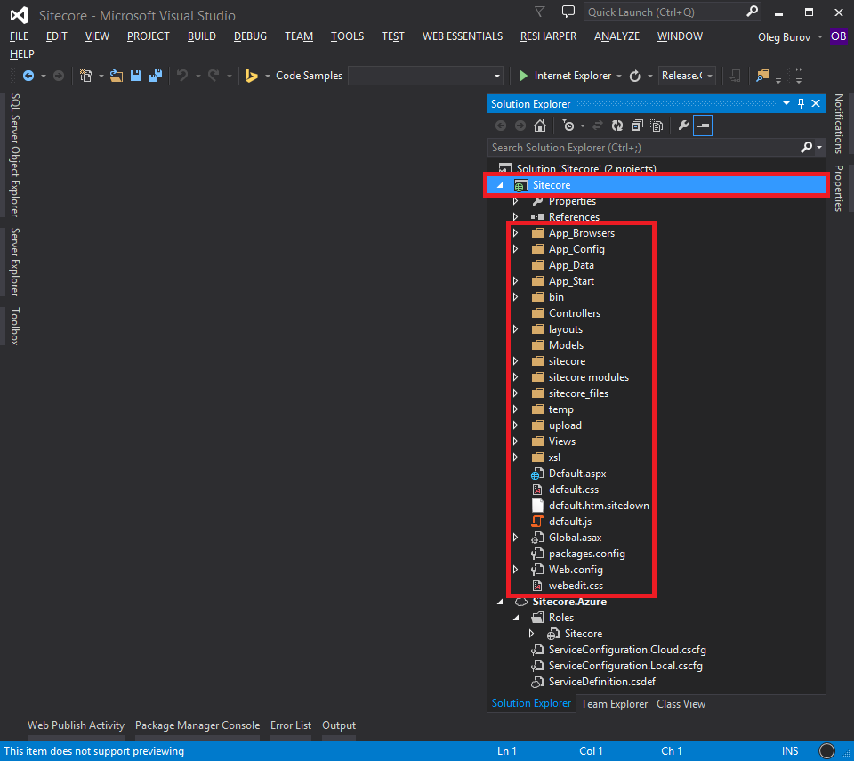
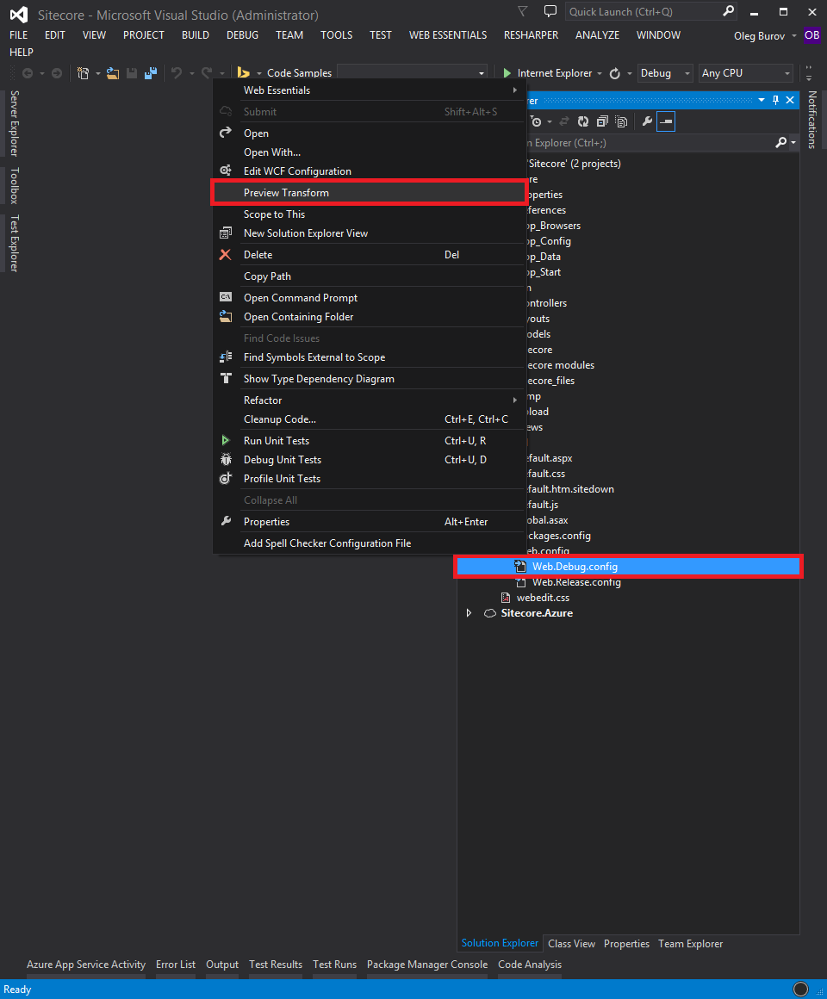
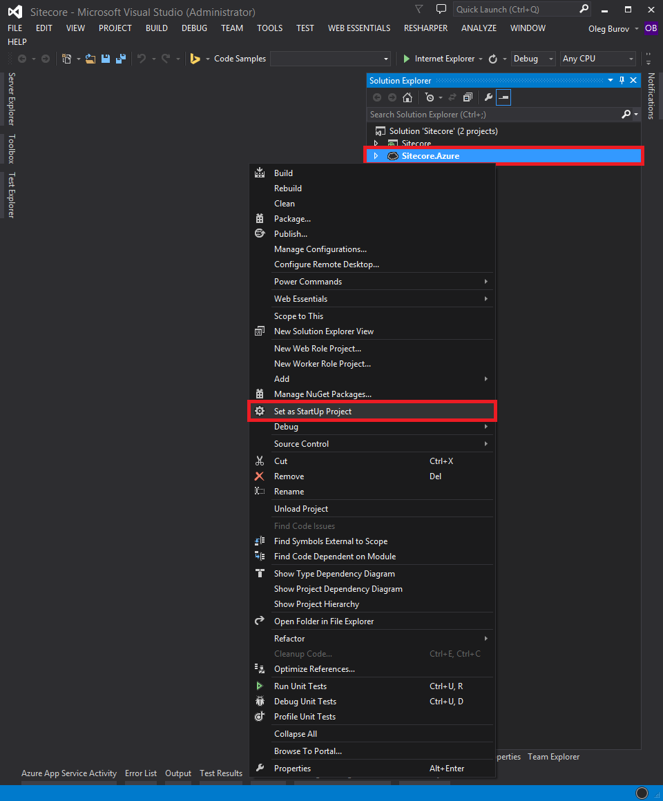
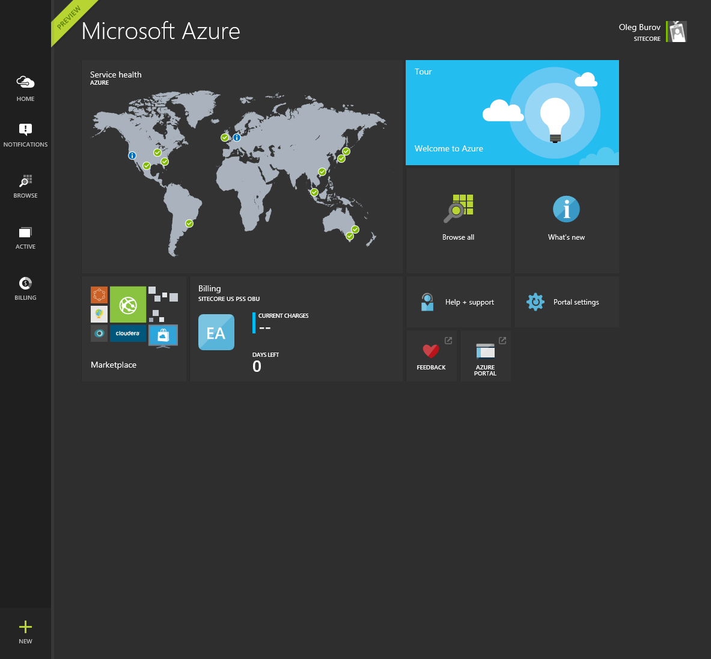
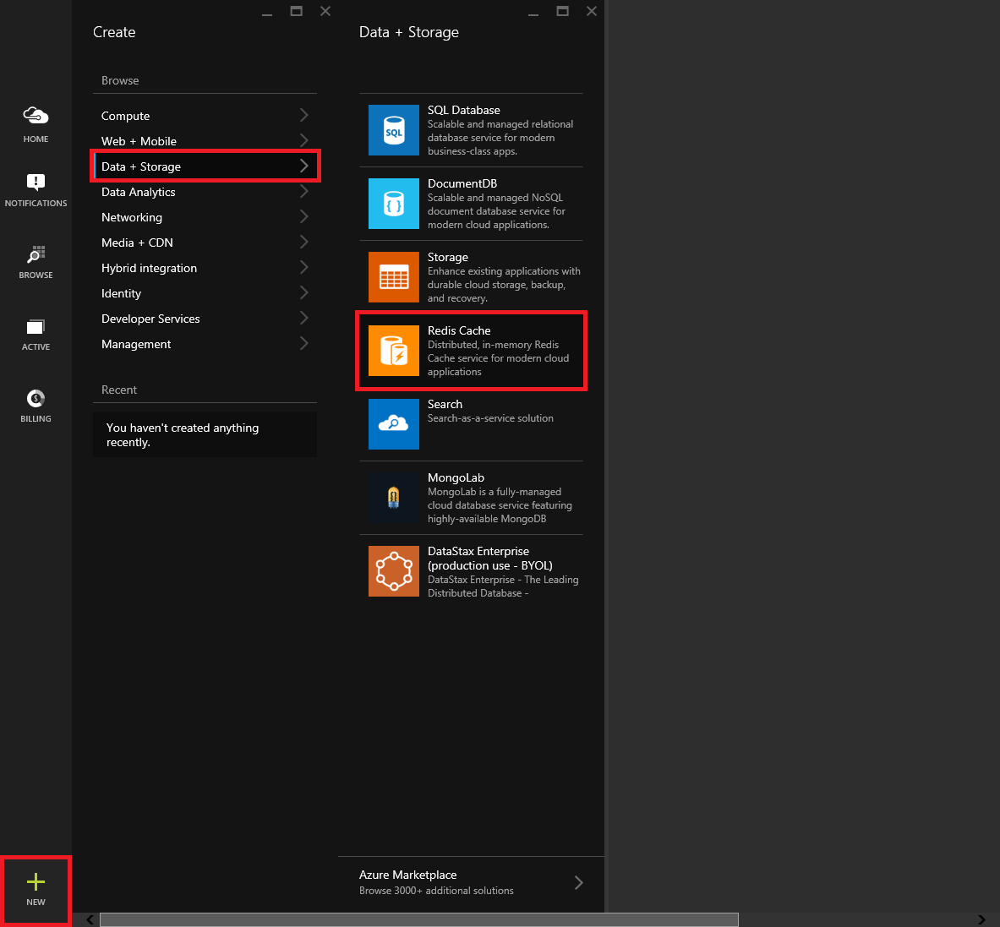
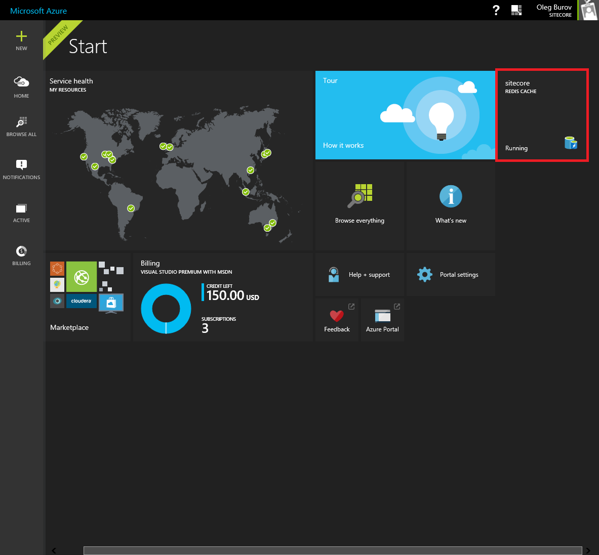
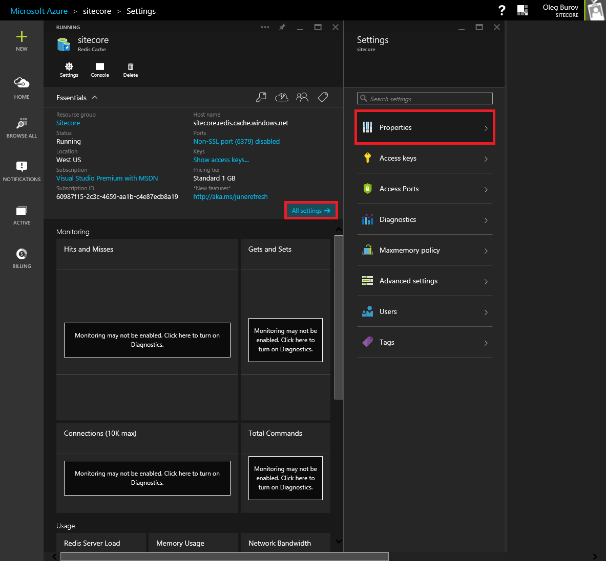
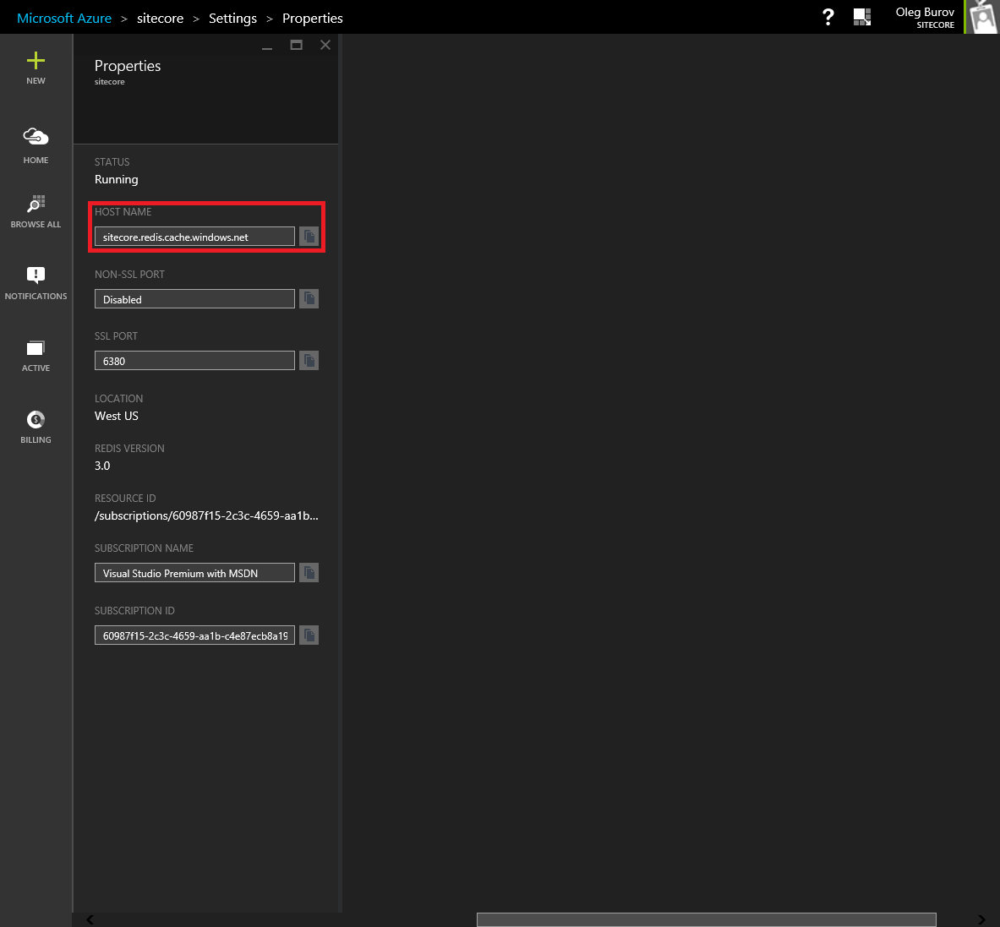
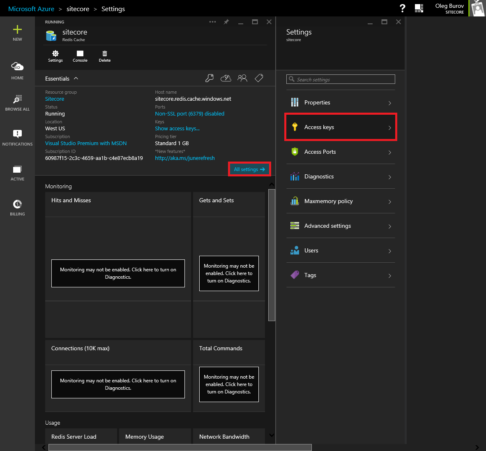

#How to deploy Sitecore 7.2 solution to Microsoft Azure Cloud Service using Visual Studio

After developing a Sitecore solution in Visual Studio, it is possible to manually publish this solution to the Microsoft Azure Cloud Platform.

This article provides a list of techniques that can be used to deploy a Sitecore solution to Microsoft Azure using Microsoft Visual Studio.

> **Important:** It is highly recommended that you get acquainted with the [Compute Hosting Options Provided by Azure](http://azure.microsoft.com/en-us/documentation/articles/fundamentals-application-models/) and [Microsoft Azure Fundamentals](http://www.microsoftvirtualacademy.com/colleges/Azure-fundamentals) before following the instructions in this article.

**Requirements:**
- A work or school account / Microsoft account and a Microsoft Azure subscription with the following Azure services enabled:
  - [Azure Cloud Service](https://msdn.microsoft.com/en-us/library/azure/jj155995.aspx)
  - [Azure Storage](https://msdn.microsoft.com/en-us/library/azure/gg433040.aspx)
  - [Azure SQL Database](https://msdn.microsoft.com/en-us/library/azure/ee336279.aspx)
  - [Azure Redis Cache](https://msdn.microsoft.com/en-us/library/azure/dn690523.aspx)
- Microsoft Visual Studio 2013
- Microsoft Azure SDK 2.5.1 for .NET
- Microsoft Azure Tool for Visual Studio 2013 
- Microsoft SQL Server Management Studio 2014
- Sitecore CMS and DMS 7.2 rev. 150408 (7.2 Update-4) or higher

> **Note:** To download the latest version of the Microsoft Azure SDK and Tool for Visual Studio, follow this link: http://azure.microsoft.com/en-us/downloads/

##Instructions

The recommended approach to deploy a Sitecore solution to Microsoft Azure using Visual Studio is as follows:

1. In the **Visual Studio**, right-click the **ASP.NET Web Application** project, and then click the **Convert -> Convert to Microsoft Cloud Service Project** in the context menu. The **Azure Cloud Service** project is generated.

   
   
   > **Note:** For information on creating an ASP.NET Web Application project for Sitecore, see the section [How To Create ASP.NET Web Application Project](how-to-create-aspnet-web-application-project.md).

2. In the **ASP.NET Web Application** project, include the default Sitecore files, directories and subdirectories.

   - For a **Content Delivery** environment:
   
     + \App_Browsers
     + \App_Config
     + \App_Data
     + \bin
     + \layouts
     + \sitecore\services
     + \sitecore modules
     + \sitecore_files
     + \temp
     + \upload
     + \xsl
     + \Default.aspx
     + \default.css
     + \default.htm.sitedown
     + \default.js
     + \Global.asax
     + \Web.config
     + \webedit.css

   - For a **Content Management** environment, additionally include the following directories and files:
     
     + \sitecore\admin
     + \sitecore\Copyright
     + \sitecore\debug
     + \sitecore\images
     + \sitecore\login
     + \sitecore\portal
     + \sitecore\samples
     + \sitecore\service
     + \sitecore\shell
     + \sitecore\blocked.aspx
     + \sitecore\default.aspx
     + \sitecore\no.css

   

   > **Important:** Visual Studio may freeze when including the entire `\sitecore\shell` directory at once because it contains a lot of files and subdirectories. Try to split all the subdirectories into portions, and then add them one by one.

3. In the **Visual Studio**, click the **Tools** -> **NuGet Package Manager** -> **Packages Manager Console**. Run the following command in the **Package Manager Console** window against the **ASP.NET Web Application** project:     
  
    ```
    Install-Package Sitecore.Azure.Setup -Version 7.2.0
    ```
   
   > **Note:** Modify both the `Web.Debug.config` and `Web.Release.config` files under the `\configuration\connectionStrings` element.
   > - For SQL Server connection strings, replace the `{server-name}` with the name of your Azure SQL Database service. The `{server-admin-login}` and `{password}` with SQL Server account credentials.
   
   > **Note:** For information on deploying Sitecore databases to Azure, see the section [How to deploy Sitecore databases to Azure SQL Database](how-to-deploy-sitecore-databases-to-azure-sql-database.md).
    
4. In the **ASP.NET Web Application** project, include the `Startup.cmd` file in the the `\bin` folder.

   

5. In the **Azure Cloud Service** project, modify the `ServiceDefinition.csdef` file under the `WebRole` element. Add the following task definition to execute the `Startup.cmd` file:

    ```xml
    <ServiceDefinition>
      <WebRole>
      ...
        <Startup>
          <Task commandLine="Startup.cmd" executionContext="elevated" taskType="simple" />
        </Startup>
      ...
      </WebRole>
    </ServiceDefinition>
    ```

6. In the **ASP.NET Web Application** project, right-click the `App_Data` item. Add the `license.xml` and `webdav.lic` files using the **Add** -> **Existing Item...** command in the context menu.

   
   
7. Log in to the **Microsoft Azure Portal** using the https://portal.azure.com URL.

   

8. In the **Jumpbar**, click the **New** button, then select the **Data + Storage** section and click the **Redis Cache** button. The **New Redis Cache** blade appears.

   

9. In the **New Redis Cache** blade, fill in the **DNS name** field and configure the other section if needed, then click the **Create** button.

   

10. In the **Startboard**, click on the **my-website** Redis Cache tile.

   

11. In the **my-website Redis Cache** blade, click the **All settings** button. The **Settings** blade appears.

   
   
12. In the **Settings** blade, click on the **Properties** section and copy the **Host Name** field value.

   

13. In the **Settings** blade, click on the **Access keys** section and copy the **Primary** field value.

   

14. In the **Visual Studio**, click **Tools** -> **NuGet Package Manager** -> **Packages Manager Console**. Run the following command in the **Package Manager Console** window against the **ASP.NET Web Application** project:
    
   ```
   Install-Package Microsoft.Web.RedisSessionStateProvider
   ```
    
15. In the **ASP.NET Web Application** project, modify the `Web.config` file under the `\configuration\system.web\sessionState mode="Custom"` element. Move the entire `sessionState mode="Custom"` element from the `Web.config` file to both the `Web.Debug.config` and `Web.Release.config` files:   

   ```xml
   <configuration>
   ...
     <system.web>
       <sessionState mode="Custom" customProvider="MySessionStateStore">
       ...
       </sessionState>
     </system.web>
   </configuration>
   ```

16. In the **ASP.NET Web Application** project, modify both the `Web.Debug.config` and `Web.Release.config` files under the `\configuration\system.web\sessionState\providers\add` element. Insert the copied Azure Redis Cache Host Name into the `host` attribute and Primary Access Key into the `accessKey` one. Additionally, insert the `xdt:Transorm` attribute into the `sessionState` element:   

   ```xml
   <configuration>
   ...
     <system.web>
       <sessionState mode="Custom" customProvider="MySessionStateStore" xdt:Transform="Replace>
         <providers>
           <add name="MySessionStateStore" type="Microsoft.Web.Redis.RedisSessionStateProvider" host="{host-name}.redis.cache.windows.net" accessKey="{primary-access-key}" ssl="true" />
         </providers>
       </sessionState>
     </system.web>
   </configuration>
   ```

   > **Note:** For information on configuring ASP.NET Session State Provider for Azure Redis Cache, see the MSDN website: https://msdn.microsoft.com/en-us/library/azure/dn690522.aspx

17. In the **Visual Studio**, click **Tools** -> **NuGet Package Manager** -> **Packages Manager Console**. Run the following command in the **Package Manager Console** window against the **ASP.NET Web Application** project:

   ```xml
   Install-Package Sitecore.Azure.Diagnostics -Version 7.2.1
   ```

   > **Note:** Modify both the `Web.Debug.config` and `Web.Release.config` files under the `\configuration\appSettings` element. Replace the `{account-name}` with the name of your storage account, and the `{account-key}` with your account access key.  

18. In the **ASP.NET Web Application** project, right-click the `Web.Debug.config` and then `Web.Release.config` files. Use the **Preview Transform** command in the context menu to check that all transformations look correct as you expect them to be.

   
   
   > **Note:** For more details about Web.config transformation syntax for Web Project Deployment using Visual Studio, see the MSDN website: http://msdn.microsoft.com/en-us/library/dd465326.aspx

19. Right-click on the **Azure Cloud Service** project and click the **Set as StartUp Project** in the context menu. Use Azure Computer Emulator to run and debug Sitecore instance locally.

   

   > **Note:** For information regarding using Emulator Express to Run and Debug a Cloud Service Locally, see the MSDN website: https://msdn.microsoft.com/library/azure/dn339018.aspx

20. Right-click the **Azure Cloud Service** project and click the **Publish...**  in the context menu. The **Publishing Azure Application** dialog box appears.

   

21. In the **Publishing Azure Application** dialog box, publish the Sitecore solution to the Microsoft Azure Cloud Platform.

   
   
   > **Note:** For the basic information about the Publish Azure Application Wizard, see the MSDN website: http://msdn.microsoft.com/en-us/library/azure/hh535756.aspx