#How to deploy Sitecore 8.0 solution to Microsoft Azure Web App using Visual Studio

After developing a Sitecore solution in Visual Studio, it is possible to manually publish this solution to the Microsoft Azure Cloud Platform.

This article provides a list of techniques that can be used to deploy a Sitecore solution to Microsoft Azure using Microsoft Visual Studio.

> **Important:** It is highly recommended that you get acquainted with the [Compute Hosting Options Provided by Azure](http://azure.microsoft.com/en-us/documentation/articles/fundamentals-application-models/) and [Microsoft Azure Fundamentals](http://www.microsoftvirtualacademy.com/colleges/Azure-fundamentals) before following the instructions in this article.

**Requirements:**
- A work or school account / Microsoft account and a Microsoft Azure subscription with the following Azure services enabled:
  - [Azure Web App](https://msdn.microsoft.com/en-us/library/azure/dn948515.aspx)
  - [Azure Storage](https://msdn.microsoft.com/en-us/library/azure/gg433040.aspx)
  - [Azure SQL Database](https://msdn.microsoft.com/en-us/library/azure/ee336279.aspx)
- Microsoft Visual Studio 2013
- Microsoft Azure SDK 2.6 for .NET
- Microsoft Azure Tool for Visual Studio 2013 
- Microsoft SQL Server Management Studio 2014
- MongoDB 2.6.1
- Sitecore® Experience Platform™ 8.0 rev. 150621 (8.0 Update-4) or higher

> **Note:** To download the latest version of the Microsoft Azure SDK and Tool for Visual Studio, follow this link: http://azure.microsoft.com/en-us/downloads/

##Instructions

The recommended approach to deploy a Sitecore solution to Microsoft Azure using Visual Studio is as follows:

1. Log in to the **Microsoft Azure Portal** using the https://portal.azure.com URL.
  
   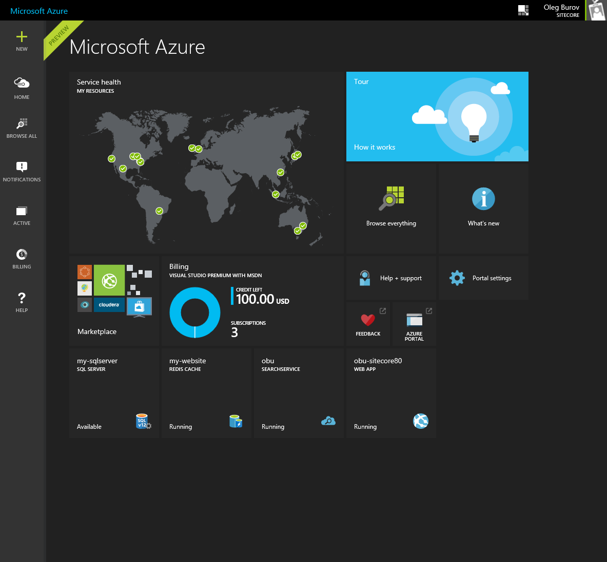
  
2. In the **Jumpbar**, click the **New** button, then select the **Web + Mobile** section and click the **Web App** button. The **Web App** blade appears.
   
   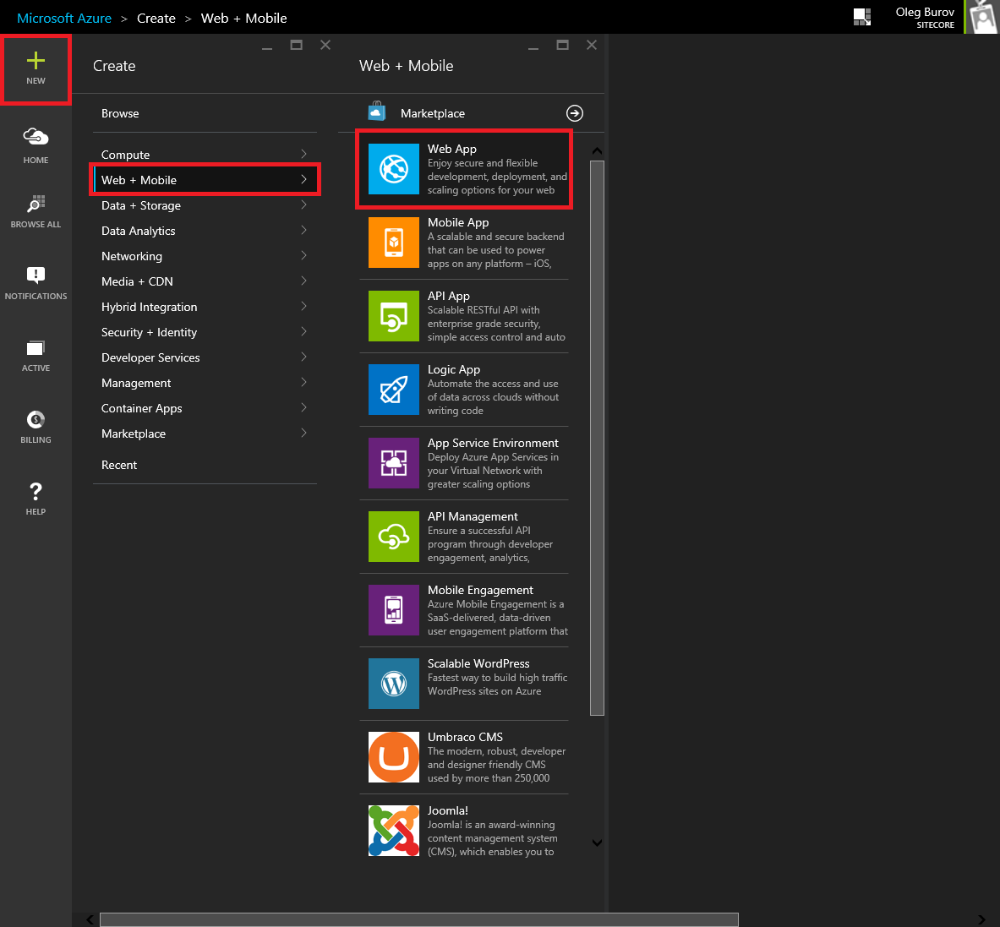
   
3. In the **Web App** blade, fill in the **URL** field and configure the other section if needed, then click the **Create** button. 
 
   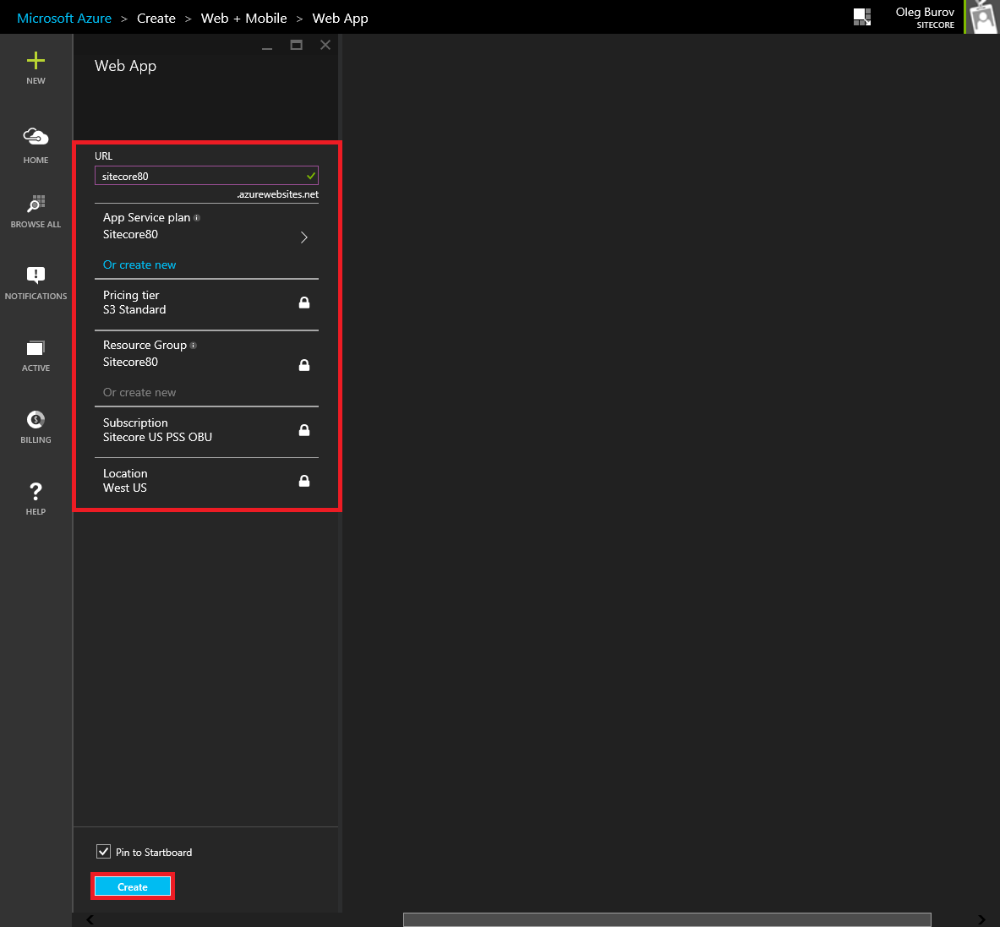
 
4. In the **Startboard**, click on the **sitecore-80** Web App tile.

   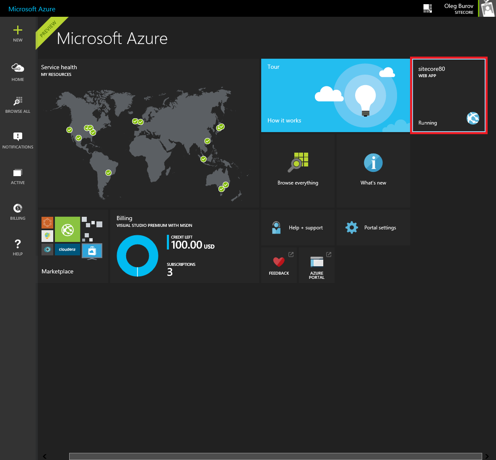

5. In the **sitecore80 Web App** blade, click the **All settings** button and select the **Application settings** section.
 
   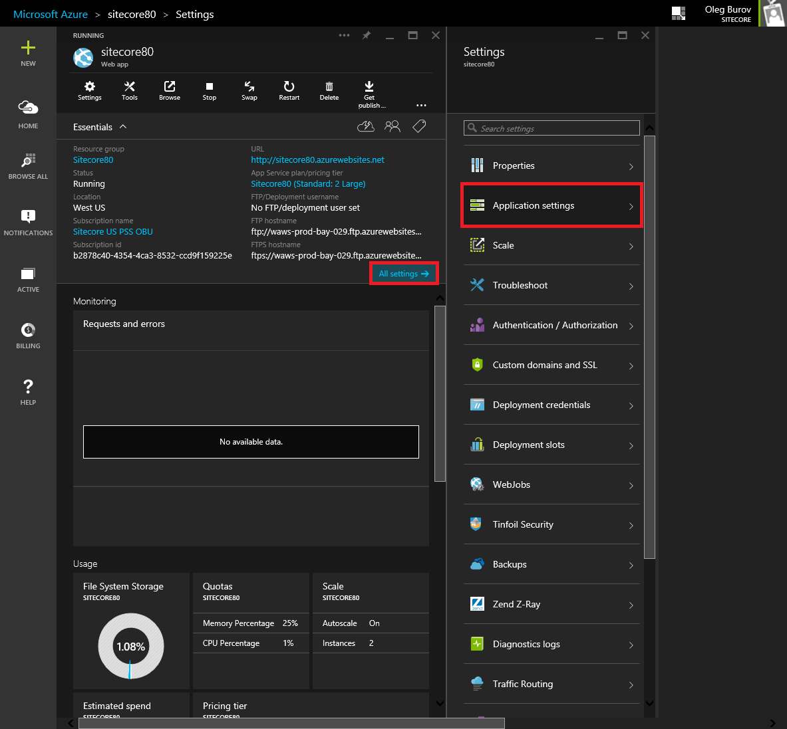
 
6. In the **Application settings** blade, configure the following groups and save the changes.
 
   In the **General settings** group:
   
   - Set the **PHP version** switcher to the **Off** value. 
   - Set the **Platform** switcher to the the **64-bit** value.
   - Set the **Always On** switcher to the the **On** value.
   - \[Optional\] Set the **Remote debugging** switcher to the **On** value and select the Visual Studio version.
   
   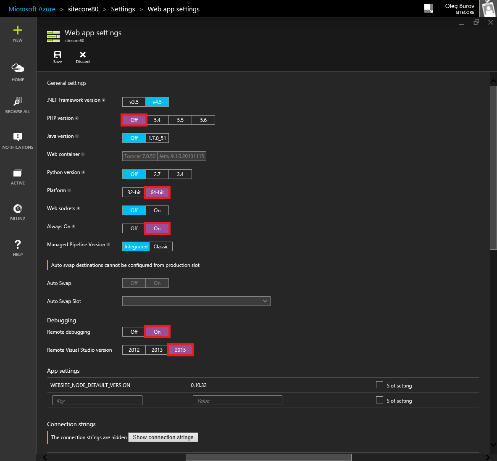
   
   In the **Connection strings** group:
   
   - Add the `core`, `master`, `web`, `reporting` and `session` SQL Database connection strings.
   - Add the `analytics`, `tracking.live`, `tracking.history` and `tracking.contact` MongoDB connection strings.   

   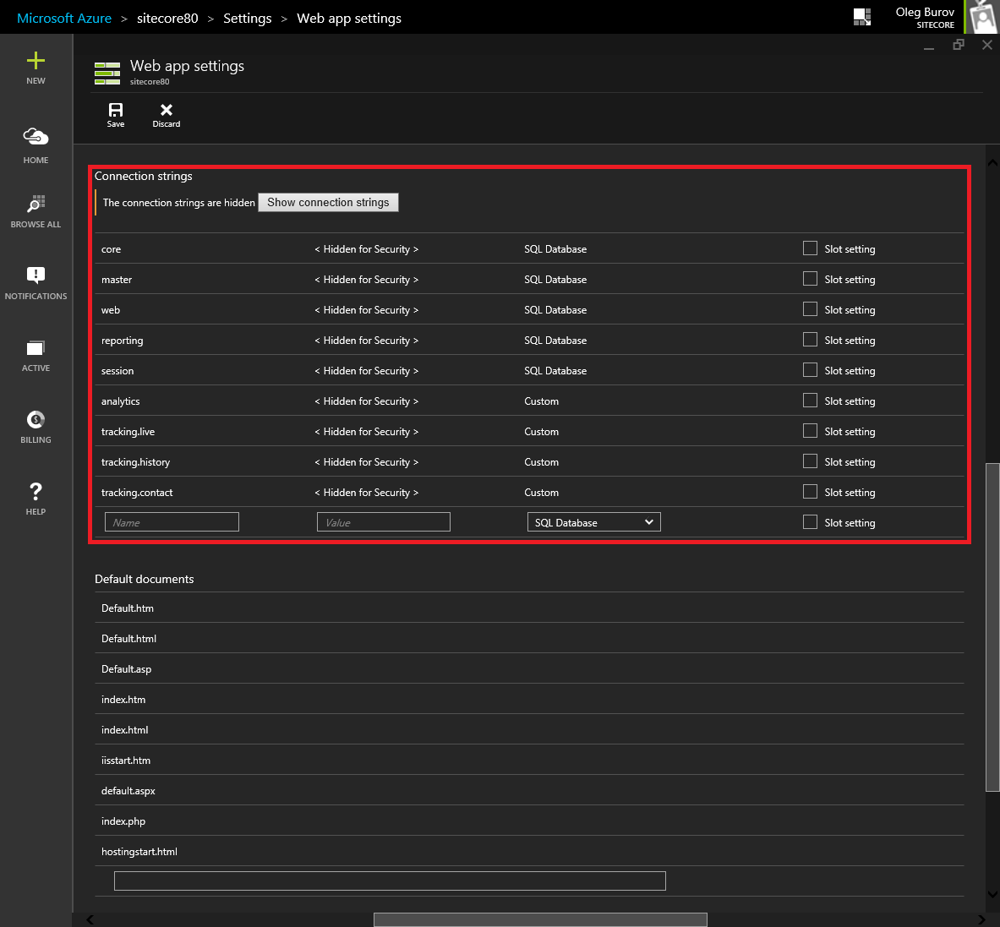

   > **Note:** Use the following templates as an example of default Sitecore connection strings:
   > - For SQL Server connection strings, replace the `{server-name}` with the name of your Azure SQL Database service. The `{server-admin-login}` and `{password}` with SQL Server account credentials. 
   > - For MongoDB connection strings, replace the `{host}` with the URL of your Mongo service. The `{user-name}` and `{password}` with your Mongo account credentials.
   
   > **Note:** For information on deploying Sitecore databases to Azure, see the section [How To Deploy Sitecore Databases](#how-to-deploy-sitecore-databases).
      
   ```
   Server=tcp:\{server-name\}.database.windows.net,1433;Database=Sitecore.Core;User ID=\{server-admin-login\}@\{server-name\};Password=\{password\};Trusted_Connection=False;Encrypt=True
   Server=tcp:\{server-name\}.database.windows.net,1433;Database=Sitecore.Master;User ID=\{server-admin-login\}@\{server-name\};Password=\{password\};Trusted_Connection=False;Encrypt=True
   Server=tcp:\{server-name\}.database.windows.net,1433;Database=Sitecore.Web;User ID=\{server-admin-login\}@\{server-name\};Password=\{password\};Trusted_Connection=False;Encrypt=True
   Server=tcp:\{server-name\}.database.windows.net,1433;Database=Sitecore.Reporting;User ID=\{server-admin-login\}@\{server-name\};Password=\{password\};Trusted_Connection=False;Encrypt=True
   Server=tcp:\{server-name\}.database.windows.net,1433;Database=Sitecore.Session;User ID=\{server-admin-login\}@\{server-name\};Password=\{password\};Trusted_Connection=False;Encrypt=True
   
   mongodb://\{user-name\}:\{password\}@\{host\}/sitecore_analytics
   mongodb://\{user-name\}:\{password\}@\{host\}/sitecore_tracking_lives
   mongodb://\{user-name\}:\{password\}@\{host\}/sitecore_tracking_historys
   mongodb://\{user-name\}:\{password\}@\{host\}/sitecore_tracking_contact 
   ```
   
7. In the **sitecore80 Web App** blade, click the **Get publish settings** button and save the **\*.PublishSettings** file in the file system.
 
   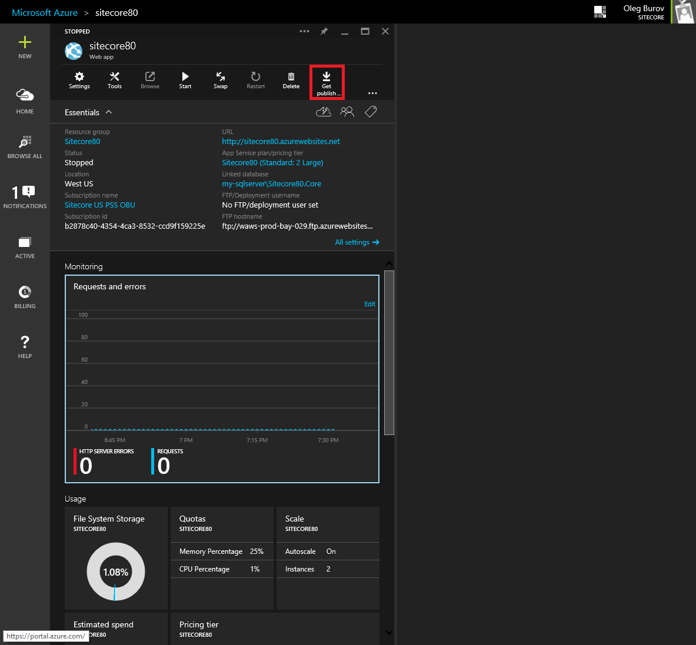
 
8. In the **ASP.NET Web Application** project, include the default Sitecore files, directories and subdirectories: 

   > **Note:** For information on creating an ASP.NET Web Application project for Sitecore, see the section [How To Create ASP.NET Web Application Project](how-to-create-aspnet-web-application-project.md).

   For a **Content Delivery** environment:

   - \App_Browsers
   - \App_Config
   - \App_Data
   - \Areas
   - \bin
   - \Controllers
   - \layouts
   - \Models
   - \sitecore\services
   - \sitecore modules
   - \sitecore_files
   - \temp
   - \upload
   - \Views
   - \xsl
   - \Default.aspx
   - \default.css
   - \default.htm.sitedown
   - \default.js
   - \Global.asax
   - \Web.config
   - \webedit.css

   For a **Content Management** environment, additionally include the following directories and files:
   
   - \sitecore\admin
   - \sitecore\Copyright
   - \sitecore\debug
   - \sitecore\images
   - \sitecore\login
   - \sitecore\portal
   - \sitecore\samples
   - \sitecore\service
   - \sitecore\shell
   - \sitecore\blocked.aspx
   - \sitecore\default.aspx
   - \sitecore\no.css

   

   > **Important:** Visual Studio may freeze when including the entire `\sitecore\shell` directory at once because it contains a lot of files and subdirectories. Try to split all the subdirectories into portions, and then add them one by one.

   > **Note:** Visual Studio may throw the following build errors:   
       
    ```
    Build: Cannot compile external modules unless the '--module' flag is provided.
    ```   
    
   > To address the error, in the **ASP.NET Web Application** project's properties, switch to the **TypeScript Build** section and set the **AMD** as the **Module system**. Otherwise, exclude both the `\sitecore\shell\client\Speak\Assets\lib\core\1.2\SitecoreSpeak.ts` and `\sitecore\shell\client\Speak\Assets\lib\core\1.2\SitecoreSpeak.d.ts` files from the project.
    
    ```
    Project file must include the .NET Framework assembly 'WindowsBase, PresentationCore, PresentationFramework' in the reference list.    
    ```
    
   > To address the error, in the **Solution Explorer** window select the `\sitecore\shell\ClientBin\EmptySplashScreen.xaml` item and set the **Build Action** to the **Content** value.
    
9. In the **Visual Studio**, click the **Tools** -> **NuGet Package Manager** -> **Packages Manager Console**. Run the following command in the **Package Manager Console** window against the **ASP.NET Web Application** project:     
  
   ```
   Install-Package Sitecore.Azure.Setup -Version 8.0.0
   ```
   
10. In the **ASP.NET Web Application** project, right-click the `App_Data` item. Add the `license.xml` and `webdav.lic` files using the **Add** -> **Existing Item...** command in the context menu.

   

11. In the **ASP.NET Web Application** project, right-click the `Web.Debug.config` and then `Web.Release.config` files. Use the **Preview Transform** command in the context menu to check that all transformations look correct as you expect them to be.

   

   > **Note:** For more details about Web.config transformation syntax for Web Project Deployment using Visual Studio, see the MSDN website: http://msdn.microsoft.com/en-us/library/dd465326.aspx
 
12. Right-click the **ASP.NET Web Application** project, and then click the **Publish...**  in the context menu. The **Publish Web** dialog box appears.     

   

13. In the **Publish Web** dialog box, in the **Profile** step, click the **Import** option and upload the **\*.PublishSettings** file. 

   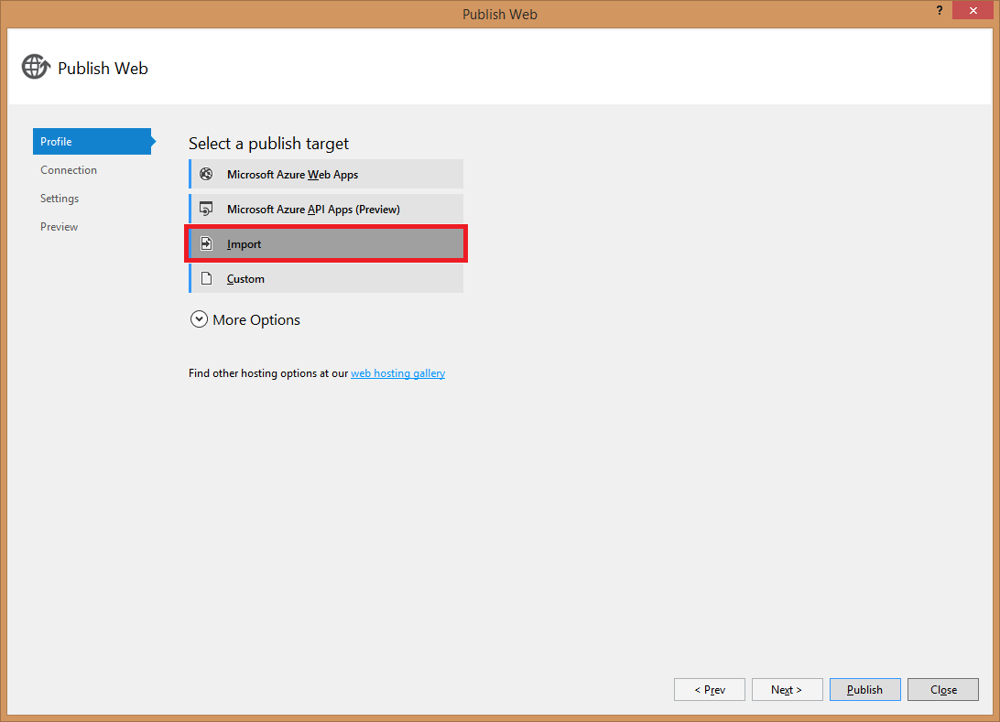

   > **Note:** For the basic information about the Publish Web Wizard, see the MSDN website: https://msdn.microsoft.com/en-us/library/dd465337(v=vs.110).aspx 
   
##How to Deploy Sitecore Databases

The recommended approach to deploy Sitecore databases to the Microsoft Azure SQL Database service is as follows:

1. Update the Sitecore database schema to fit the **Azure SQL Database** service requirements:
   - For Sitecore XP 8.0 - execute the [SQL Azure [Session].sql](./media/how-to-deploy-sitecore-80-solution-to-microsoft-azure-web-app-using-visual-studio/SQL Azure [Session].sql) script on the Sitecore Session database.
   
2. In the **SQL Server Management Studio**, in the **Object Explorer**, right-click a Sitecore database, and select **Tasks -> Export Data-tier Application...** in the context menu. The **Export data-tier Application** dialog box appears. 

   

3. In the **Export data-tier Application** dialog box, click the **Next >** button to go to the **Export Settings** step. 

   

4. In the **Export Settings** step, browse a location for a `*.bacpac` file to be stored in the file system. Then click the **Next >** button to go to the **Summary** step. 

   

5. In the **Summary** step, click the **Finish** button to start creating a `*.bacpac` file. 

   

6. In the **Results** step, click the **Close** button when the operation is complete. 

   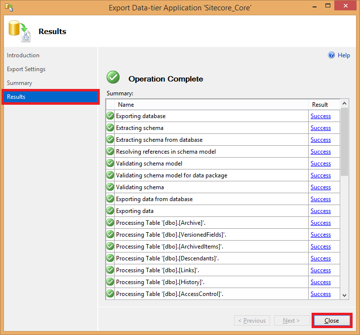

7. Repeat steps 2-5 for each Sitecore database you want to export.
 
8. In the **Visual Studio**, in the **Server Explorer**, right-click the `/Azure/Storage` item, and then click the **Create Storage Account...** in the context menu. The **Create Storage Account** dialog box appears. 

   

9. In the **Create Storage Account** dialog box, fill in the **Subscription**, **Name**, **Region or Affinity Group** and **Replication** fields, and click the **Create** button. The **Azure Storage** service is created. 

   

10. In the **Server Explorer**, right click the `/Azure/Storage/<StorageAccount>/Blobs` item, and then click the **Create Blob Container...** in the context menu. The **Create Blob Container** dialog box appears.
  
   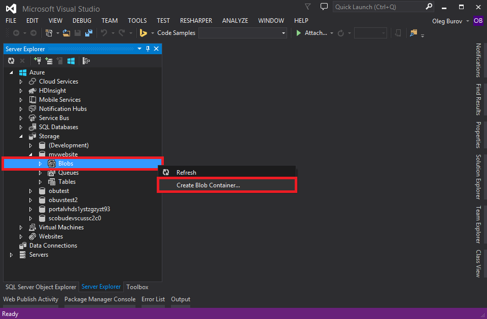
    
11. In the **Create Blob Container** dialog box, enter a name for the new blob container and click the **OK** button. 

   
   
12. In the **Server Explorer**, double click the created container, and then click the **Upload Blob** button. 

   

13. Upload the `*.bacpac` files to the container.

   

14. Log in to the **Microsoft Azure Portal** using the https://portal.azure.com URL. 

   

15. In the **Jumpbar**, click the **New** button, then select the **Data + Storage** section and click the **SQL Database** button. The **SQL Database** blade appears. 

   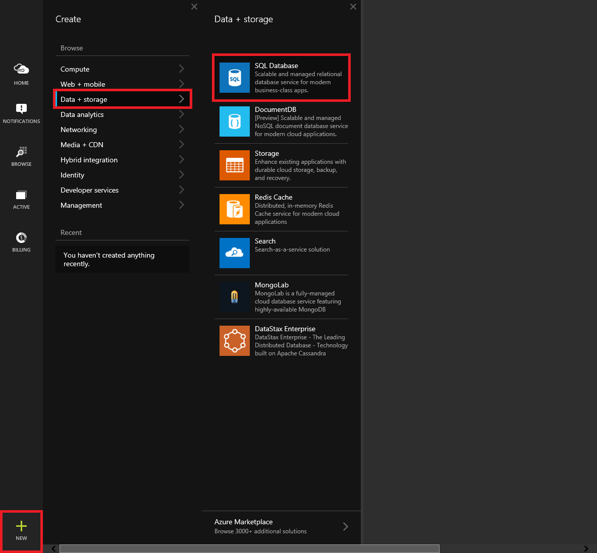

16. In the **SQL Database** blade, click on the **Server** section. Then create a new server configuration. 

  
  
  > **Note:** Sitecore recommends using [Azure SQL Database V12](http://azure.microsoft.com/en-us/documentation/articles/sql-database-v12-whats-new/) service to get the better experience.

17. In the **SQL Database** blade, fill in the **Name** field and configure the other section if needed, then click the **Create** button.

  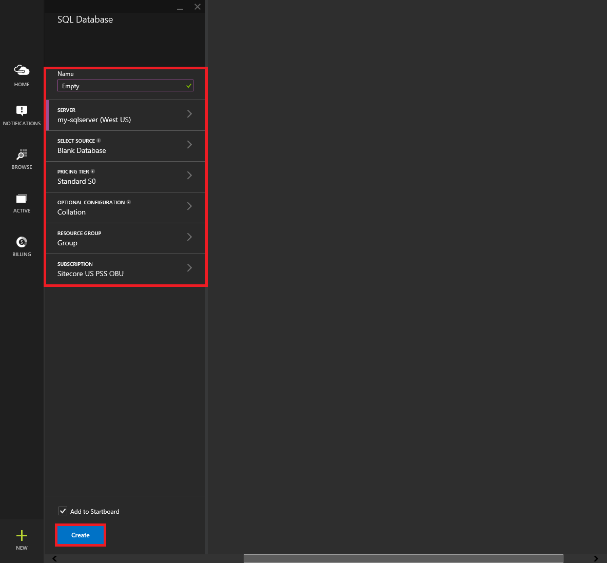

18. In the **Startboard**, click on the **Empty SQL Database** tile.

  

19. In the **Empty SQL Database** blade, click the **Delete** button.

  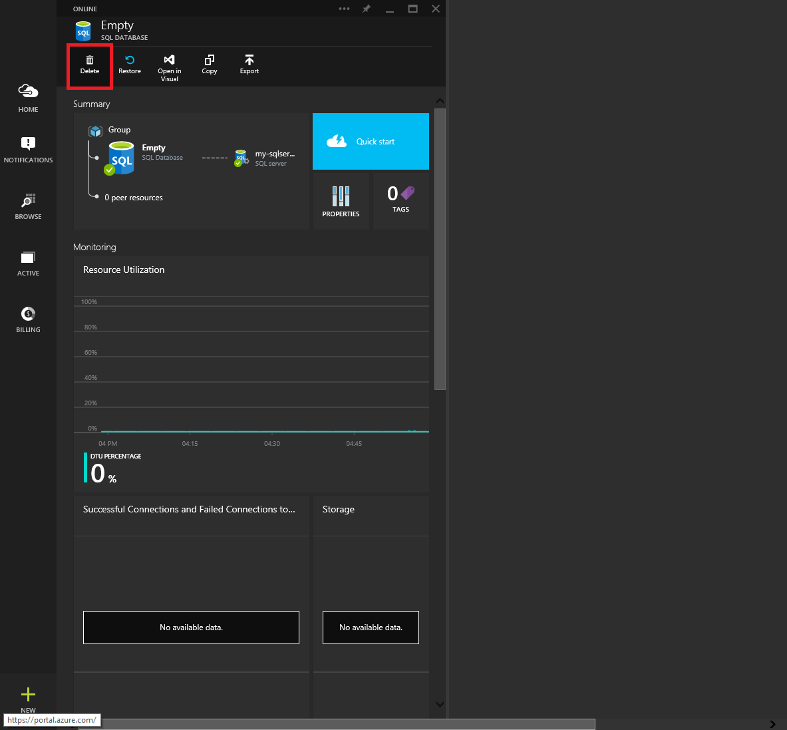

20. In the **Jumpbar**, click the **Browser** button and select the **SQL servers** from the list. The **Browser** and **SQL servers** blades appear.

  

21. In the **SQL servers** blade, click on the SQL Server instance you created before. The **SQL Server** blade appears.

  

22. In the **SQL Server** blade, click the **Import database** button in the top menu. The **Import Database** blade appears.

  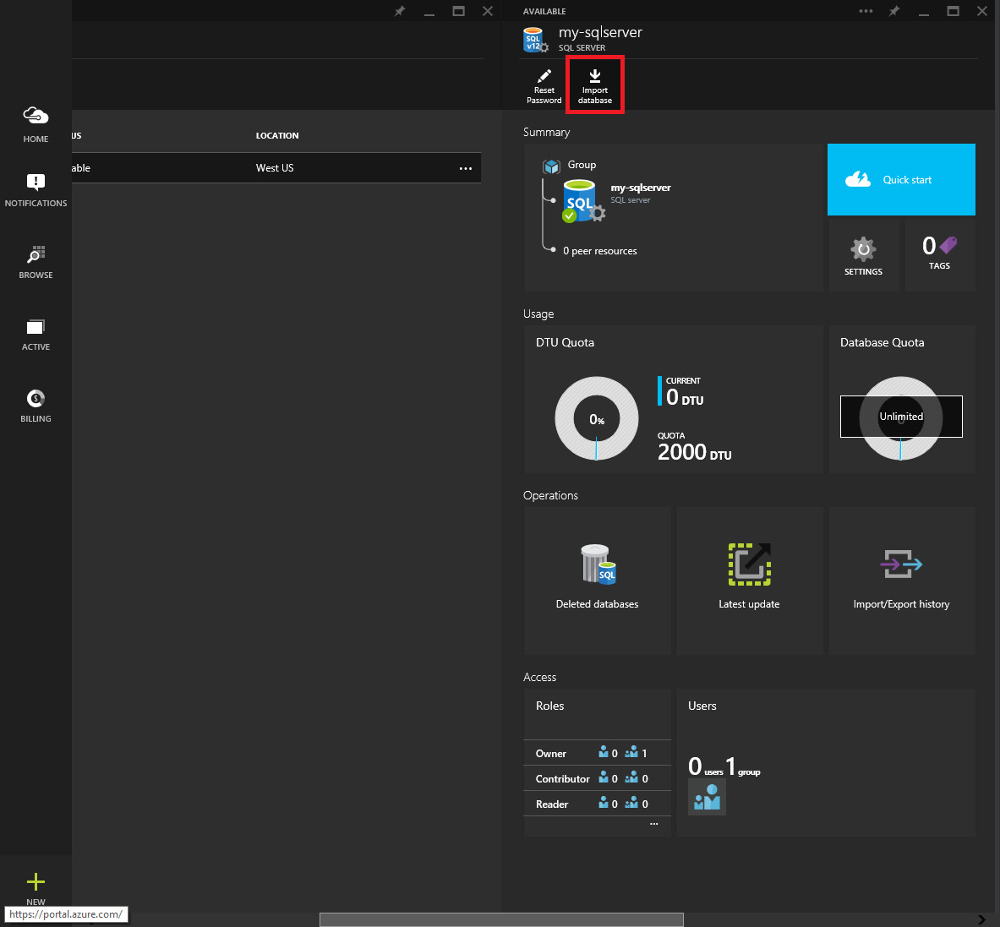

23. In the **Import Database** blade, select the created storage account and container with `*.bacpac` file, then click the **OK** button.

  

24. In the **Import Database** blade, configure the **Pricing Tier** section and fill in the **Database Name**, **Server Admin Login** and **Password** fields, then click the **Create** button.

  

25. Repeat steps 22-24 for each Sitecore database you want to import.

##Download Options

Exported Sitecore databases as `*.bacpac` files:
- [Sitecore80.Core.bacpac](./media/how-to-deploy-sitecore-80-solution-to-microsoft-azure-web-app-using-visual-studio/Sitecore80.Core.bacpac)
- [Sitecore80.Master.bacpac](./media/how-to-deploy-sitecore-80-solution-to-microsoft-azure-web-app-using-visual-studio/Sitecore80.Master.bacpac)
- [Sitecore80.Web.bacpac](./media/how-to-deploy-sitecore-80-solution-to-microsoft-azure-web-app-using-visual-studio/Sitecore80.Web.bacpac)
- [Sitecore80.Reporting.bacpac](./media/how-to-deploy-sitecore-80-solution-to-microsoft-azure-web-app-using-visual-studio/Sitecore80.Reporting.bacpac)
- [Sitecore80.Session.bacpac](./media/how-to-deploy-sitecore-80-solution-to-microsoft-azure-web-app-using-visual-studio/Sitecore80.Session.bacpac)