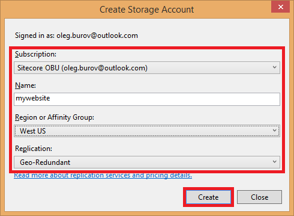
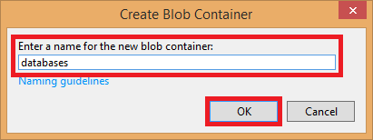
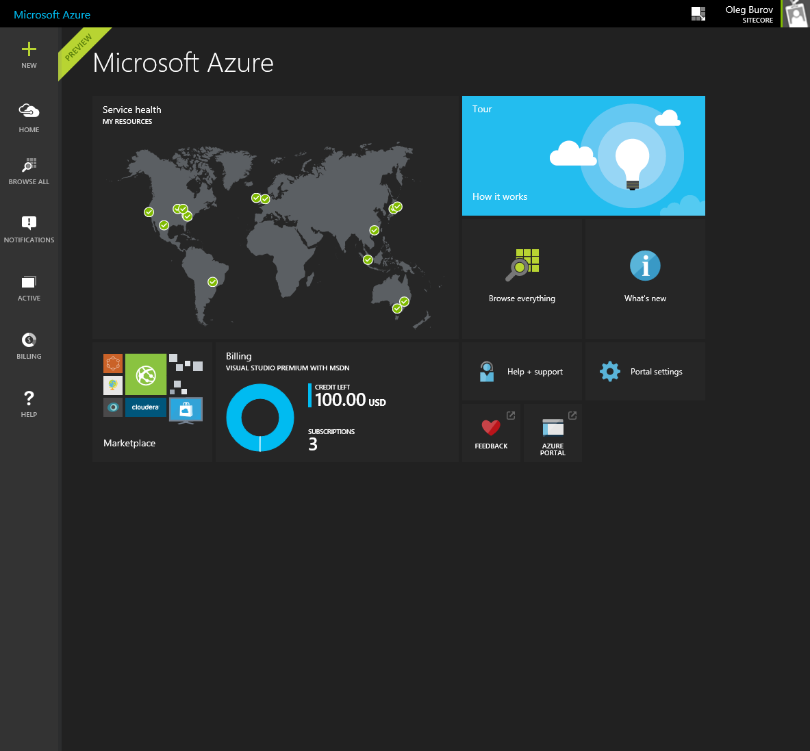

#How to deploy Sitecore databases to Azure SQL Database

The recommended approach to deploy Sitecore databases to the [Microsoft Azure SQL Database](https://msdn.microsoft.com/en-us/library/azure/ee336279.aspx) service is as follows:

1. Update the Sitecore database schema to fit the **Azure SQL Database** service requirements:
   - For Sitecore CMS 7.2 - execute the [SQL Azure \[Core, Master, Web\].sql](./media/how-to-deploy-sitecore-databases-to-azure-sql-database/SQL Azure [Core, Master, Web].sql) script on the Sitecore Core, Master and Web databases.
   - For Sitecore DMS 7.2 - execute the [SQL Azure \[Analytics\].sql](./media/how-to-deploy-sitecore-databases-to-azure-sql-database/SQL Azure [Analytics].sql) script on the Sitecore Analytics databases.
   - For Sitecore XP 7.5 and 8.0 - execute the [SQL Azure [Session].sql](./media/how-to-deploy-sitecore-databases-to-azure-sql-database/SQL Azure [Session].sql) script on the Sitecore Session database.   
   
2. In the **SQL Server Management Studio**, in the **Object Explorer**, right-click a Sitecore database, and select **Tasks -> Export Data-tier Application...** in the context menu. The **Export data-tier Application** dialog box appears. 

   

3. In the **Export data-tier Application** dialog box, click the **Next >** button to go to the **Export Settings** step. 

   

4. In the **Export Settings** step, browse a location for a `*.bacpac` file to be stored in the file system. Then click the **Next >** button to go to the **Summary** step. 

   

5. In the **Summary** step, click the **Finish** button to start creating a `*.bacpac` file. 

   

6. In the **Results** step, click the **Close** button when the operation is complete. 

   

7. Repeat steps 2-5 for each Sitecore database you want to export.
 
8. In the **Visual Studio**, in the **Server Explorer**, right-click the `/Azure/Storage` item, and then click the **Create Storage Account...** in the context menu. The **Create Storage Account** dialog box appears. 

   

9. In the **Create Storage Account** dialog box, fill in the **Subscription**, **Name**, **Region or Affinity Group** and **Replication** fields, and click the **Create** button. The **Azure Storage** service is created. 

   

10. In the **Server Explorer**, right click the `/Azure/Storage/<StorageAccount>/Blobs` item, and then click the **Create Blob Container...** in the context menu. The **Create Blob Container** dialog box appears.
  
   
    
11. In the **Create Blob Container** dialog box, enter a name for the new blob container and click the **OK** button. 

   
   
12. In the **Server Explorer**, double click the created container, and then click the **Upload Blob** button. 

   

13. Upload the `*.bacpac` files to the container.

   

14. Log in to the **Microsoft Azure Portal** using the https://portal.azure.com URL. 

   

15. In the **Jumpbar**, click the **New** button, then select the **Data + Storage** section and click the **SQL Database** button. The **SQL Database** blade appears. 

   

16. In the **SQL Database** blade, click on the **Server** section. Then create a new server configuration. 

  
  
  > **Note:** Sitecore recommends using [Azure SQL Database V12](http://azure.microsoft.com/en-us/documentation/articles/sql-database-v12-whats-new/) service to get the better experience.

17. In the **SQL Database** blade, fill in the **Name** field and configure the other section if needed, then click the **Create** button.

  

18. In the **Startboard**, click on the **Empty SQL Database** tile.

  

19. In the **Empty SQL Database** blade, click the **Delete** button.

  

20. In the **Jumpbar**, click the **Browser** button and select the **SQL servers** from the list. The **Browser** and **SQL servers** blades appear.

  

21. In the **SQL servers** blade, click on the SQL Server instance you created before. The **SQL Server** blade appears.

  

22. In the **SQL Server** blade, click the **Import database** button in the top menu. The **Import Database** blade appears.

  

23. In the **Import Database** blade, select the created storage account and container with `*.bacpac` file, then click the **OK** button.

  

24. In the **Import Database** blade, configure the **Pricing Tier** section and fill in the **Database Name**, **Server Admin Login** and **Password** fields, then click the **Create** button.

  

25. Repeat steps 22-24 for each Sitecore database you want to import.

##Download Options

Exported Sitecore databases as `*.bacpac` files:
- [Sitecore72.Core.bacpac](./media/how-to-deploy-sitecore-databases-to-azure-sql-database/Sitecore72.Core.bacpac)
- [Sitecore72.Master.bacpac](./media/how-to-deploy-sitecore-databases-to-azure-sql-database/Sitecore72.Master.bacpac)
- [Sitecore72.Web.bacpac](./media/how-to-deploy-sitecore-databases-to-azure-sql-database/Sitecore72.Web.bacpac)
- [Sitecore72.Analytics.bacpac](./media/how-to-deploy-sitecore-databases-to-azure-sql-database/Sitecore72.Analytics.bacpac)

- [Sitecore75.Core.bacpac](./media/how-to-deploy-sitecore-databases-to-azure-sql-database/Sitecore75.Core.bacpac)
- [Sitecore75.Master.bacpac](./media/how-to-deploy-sitecore-databases-to-azure-sql-database/Sitecore75.Master.bacpac)
- [Sitecore75.Web.bacpac](./media/how-to-deploy-sitecore-databases-to-azure-sql-database/Sitecore75.Web.bacpac)
- [Sitecore75.Reporting.bacpac](./media/how-to-deploy-sitecore-databases-to-azure-sql-database/Sitecore75.Reporting.bacpac)
- [Sitecore75.Session.bacpac](./media/how-to-deploy-sitecore-databases-to-azure-sql-database/Sitecore75.Session.bacpac)

- [Sitecore80.Core.bacpac](./media/how-to-deploy-sitecore-databases-to-azure-sql-database/Sitecore80.Core.bacpac)
- [Sitecore80.Master.bacpac](./media/how-to-deploy-sitecore-databases-to-azure-sql-database/Sitecore80.Master.bacpac)
- [Sitecore80.Web.bacpac](./media/how-to-deploy-sitecore-databases-to-azure-sql-database/Sitecore80.Web.bacpac)
- [Sitecore80.Reporting.bacpac](./media/how-to-deploy-sitecore-databases-to-azure-sql-database/Sitecore80.Reporting.bacpac)
- [Sitecore80.Session.bacpac](./media/how-to-deploy-sitecore-databases-to-azure-sql-database/Sitecore80.Session.bacpac)