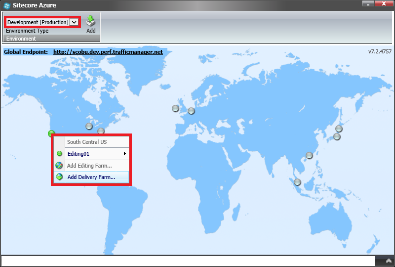
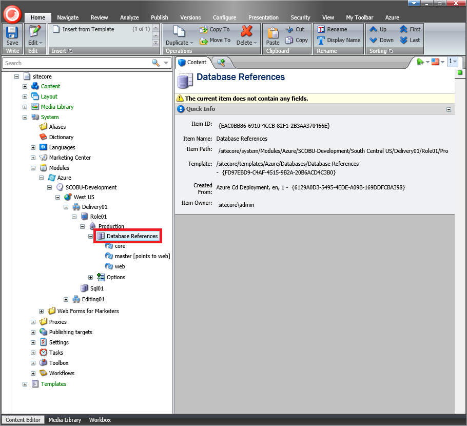
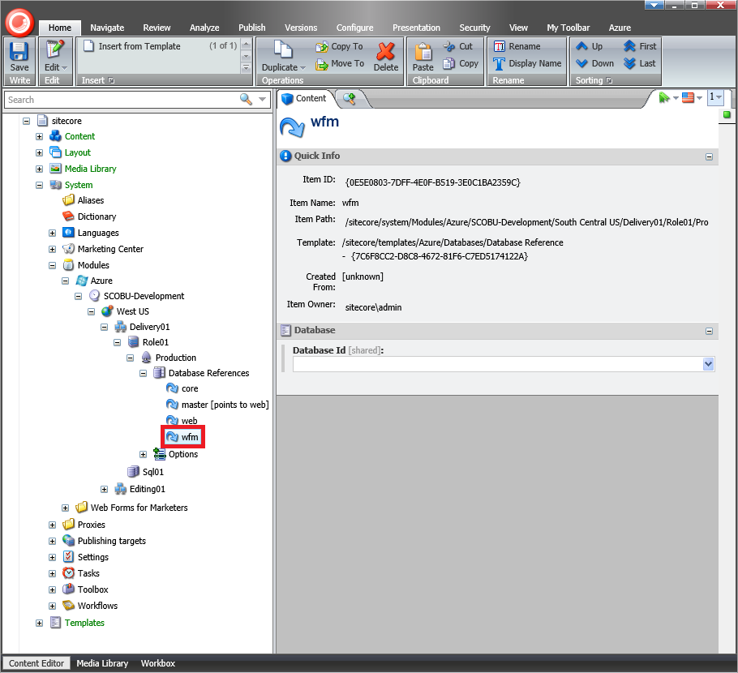
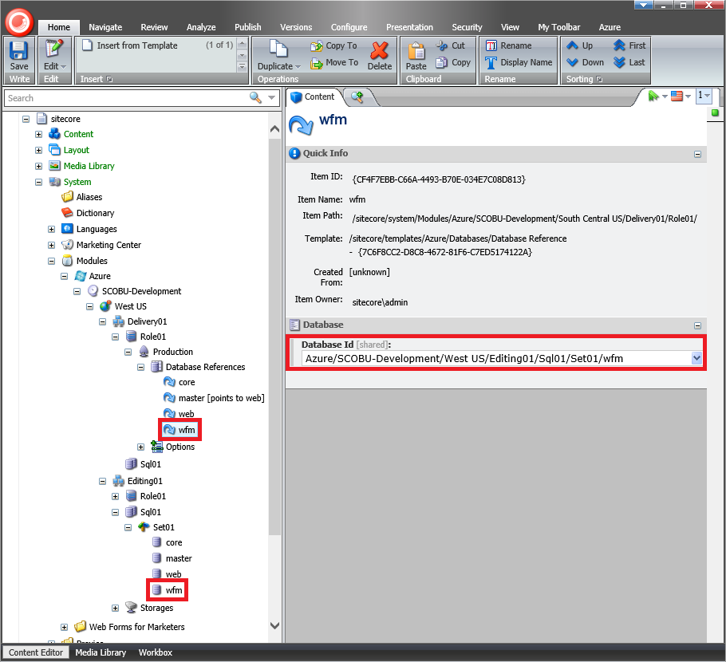
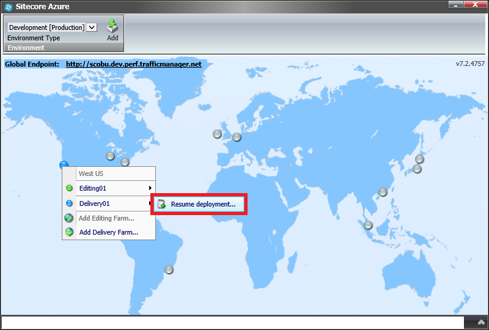

#How to share a database between Farms in Sitecore Azure

The Sitecore Azure module automatically creates the [Microsoft Azure SQL Databases Service](https://msdn.microsoft.com/en-us/library/azure/ee336279.aspx) and deploys the default Sitecore Core, Master and Web databases during deployment.

However, the module also allows using an existing database from another Farm. For example, this can be useful for sharing one database between Editing and Delivery Farms.

This article provides a list of techniques that can be used to manually share a database between Farms using the Sitecore Azure module.

##Solution

The recommended approach to share a database between Farms in Sitecore Azure is as follows:   

1. Log in to the **Sitecore Client** and open the **Sitecore Azure** application.

2. Select either the **Staging** or **Production** slot and click on a data center to add an **Editing** or **Delivery Farm**.

   
   
3. In the **New Deployment** dialog, click the **More Options** button. The **Content Editor** with a preselected `Azure Deployment` item appears.

   
   
4. Select the `/sitecore/system/Modules/Azure/<Environment>/<Location>/<Farm>/<WebRole>/<Azure Deployment>/Database References` item.

   
   
5. Insert a new item based on the `/sitecore/templates/Azure/Databases/Database Reference` template, using `wfm` name as the item name.

   
   
   > **Important:** an item name must match a connection string name.

   > **Note:** for example, in the \App_Config\ConnectionStrings.config file, the connection string to the Sitecore Web Forms for Marketers database is as follows:

   ```xml
   <connectionStrings>
   ...
     <add name="wfm" connectionString="Data Source=.\SQLEXPRESS2014;Initial Catalog=Sitecore_WFM;Integrated Security=False;User ID=sa;Password=12345" />
   ...
   </connectionStrings>
   ```
   
6. In the `wfm` item, fill in the **Database Id** field using an existent `Azure SQL Database` item under the `/Sitecore/system/Modules/Azure/<Environment>/<Location>/<Farm>/Sql01/Set01` item.

   
   
7. Save the changes and close the **Content Editor** application.

8. Recycle the Sitecore Application Pool or reset Internet Information Services (IIS).

9. Open the **Sitecore Azure** application and resume the deployment.

   
   
10. In the **New Deployment** dialog, click the **Start Deployment** button.

   