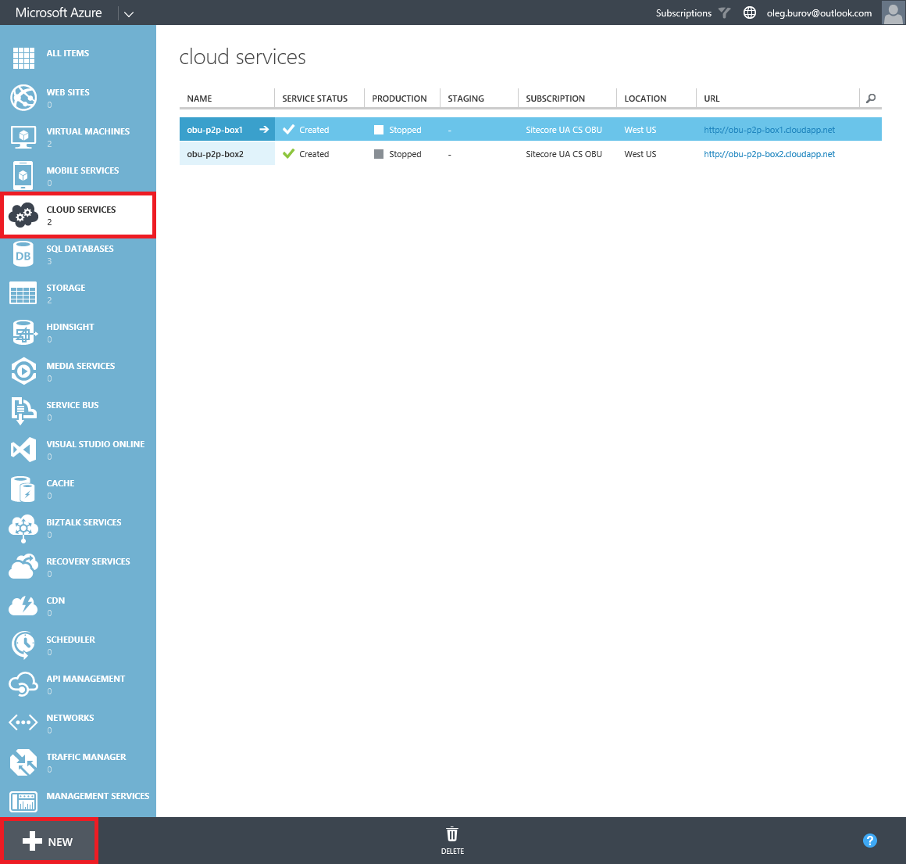
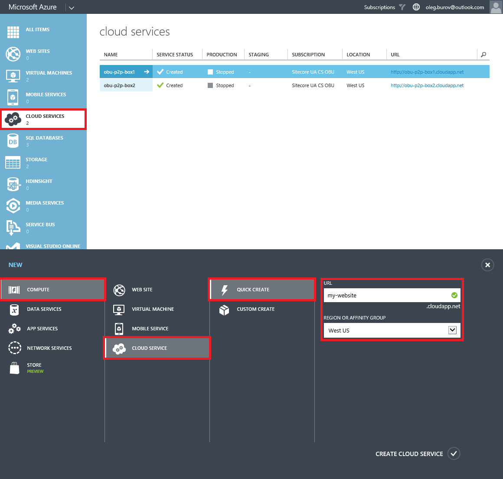
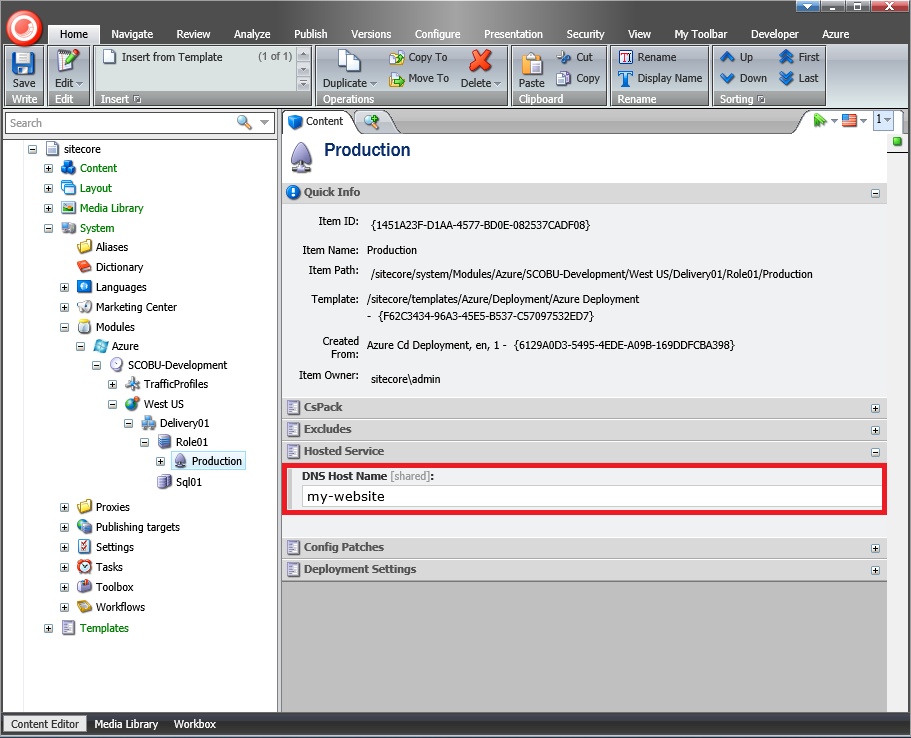

#How to use a custom Azure Cloud Service in Sitecore Azure

The Sitecore Azure module automatically creates all Microsoft Azure services it uses during deployment, as well as generates names for them. The pattern for generating names depends on the project name and environment type from the Sitecore Azure Environment file, as well as the deployment location, deployment type, etc.

One of the services used during deployment is the Microsoft Azure Cloud Service. Microsoft Azure requires that the name of the Microsoft Azure Cloud Service be unique, since it is used as a part of the public URL prefix for the *.cloudapp.net host name.

This article provides a list of techniques that can be used to manually create the Microsoft Azure Cloud Service and deploy a Sitecore solution using this Cloud Service when using the Sitecore Azure module.

##Solution

Here is the recommended approach of how you can use your custom Azure Cloud Service in Sitecore Azure:

1. Log in to the **Microsoft Azure Management Portal** using the https://manage.windowsazure.com URL.
 
2. In the **Cloud Services** section, click the **New** button.

   

3. Create a custom Cloud Service (Compute -> Cloud Service -> Quick Create or Custom Create).

   
   
   **Important:** If you create a custom Cloud Service, you must create a custom Storage Service, too.
   
   **Note:** How to use a custom Azure Storage Service in Sitecore Azure, see the [How to use a custom Azure Storage Service in Sitecore Azure](how-to-use-a-custom-azure-storage-service-in-sitecore-azure.md) article.

4. Log in to the **Sitecore Client** and open the **Sitecore Azure** application.

5. Select either the **Staging** or **Production** slot and click on a data center to add an **Editing** or **Delivery Farm**. 

   
   
6. In the **New Deployment** dialog, click the **More Options** button. The **Content Editor** with a preselected **Azure Deployment** item appears.

   

7. In the **Hosted Service** section, in the **DNS Host Name** field, set the same Cloud Service that is created in the **Microsoft Azure Management Portal**.

   
   
8. Save the changes and close the **Content Editor** application.

9. In the **New deployment** dialog, click the **Start Deployment** button.
   
   