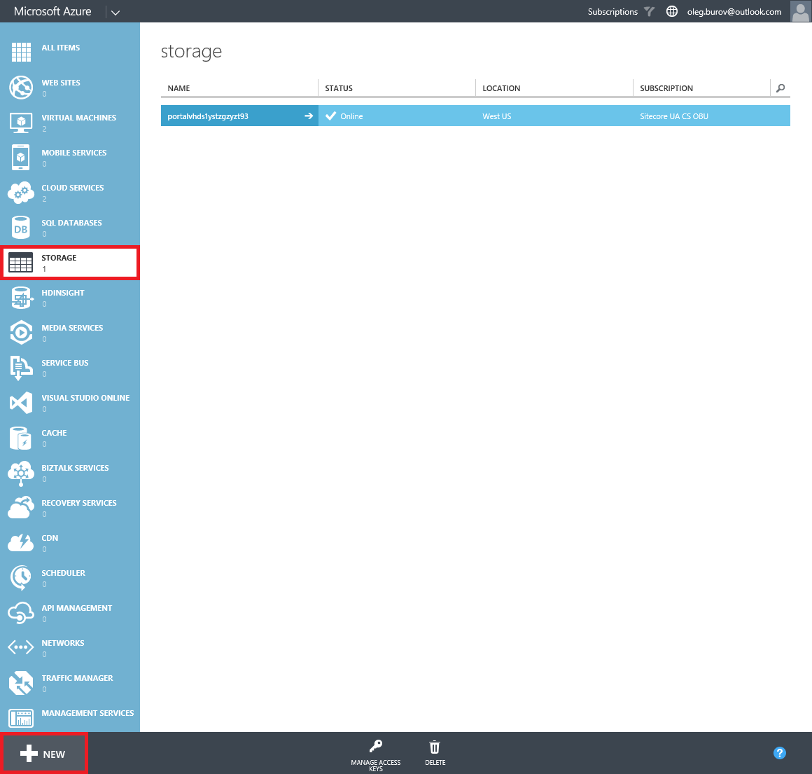
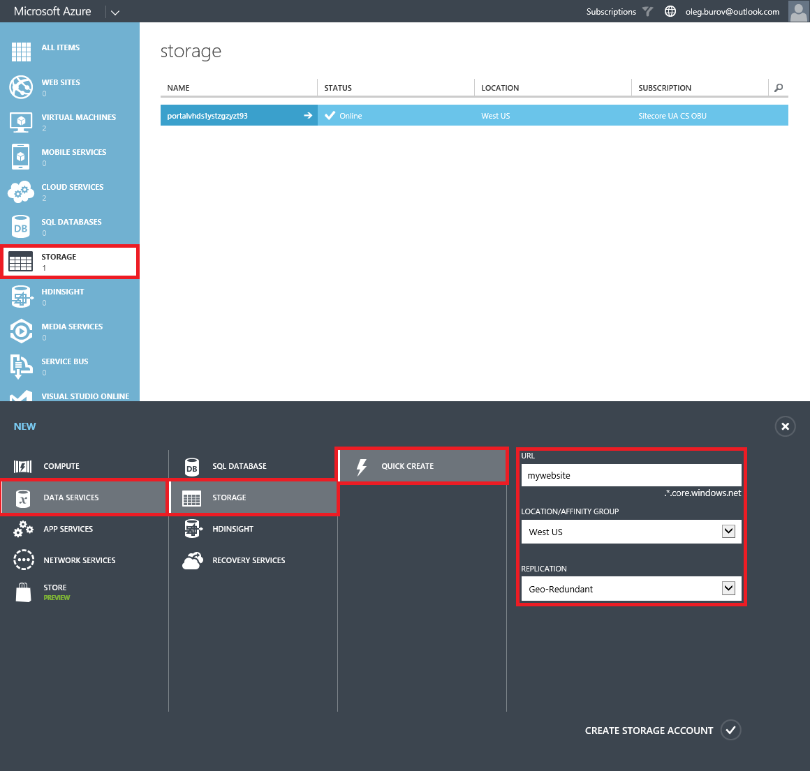
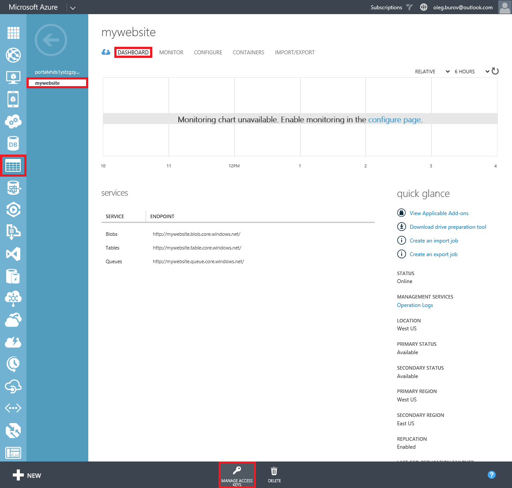
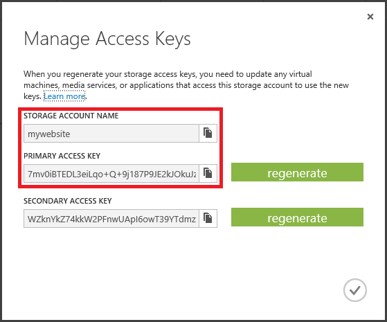
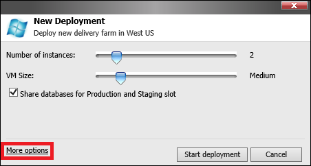
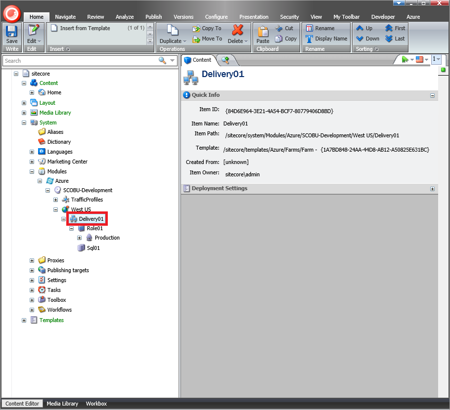
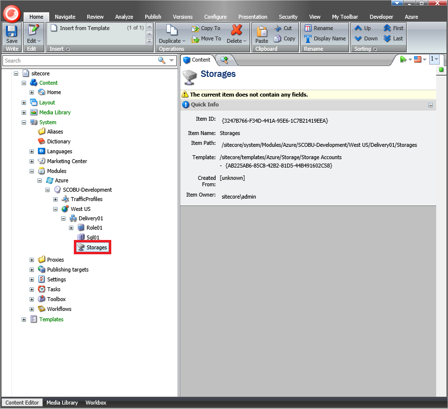
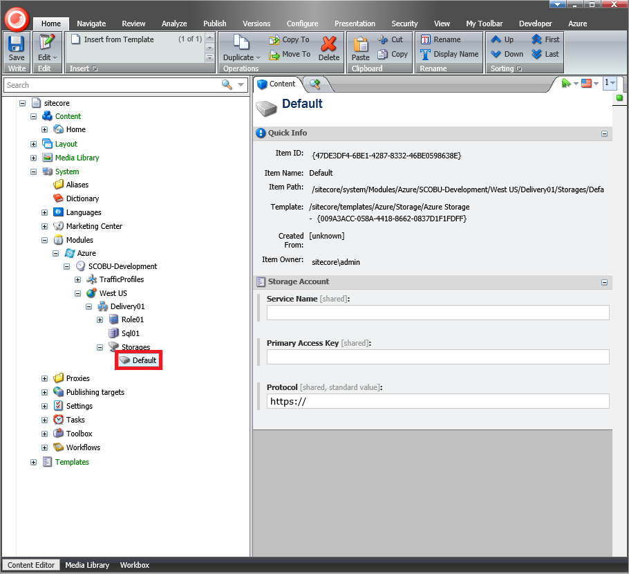
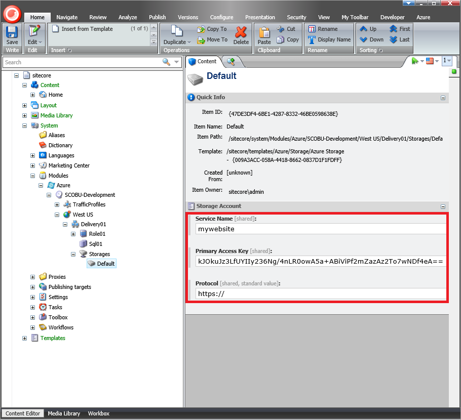
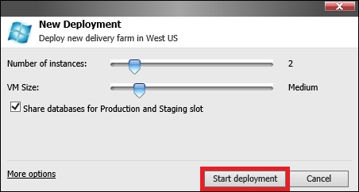

#How to use a custom Azure Storage Service in Sitecore Azure

The Sitecore Azure module automatically creates all Microsoft Azure services it uses during deployment, as well as generates names for them. The pattern for generating names depends on the project name and environment type from the Sitecore Azure Environment file, as well as the deployment location, deployment type, etc.

One of the services used during deployment is the [Microsoft Azure Storage Service](https://msdn.microsoft.com/en-us/library/azure/gg433040.aspx). Microsoft Azure requires that the name of the Microsoft Azure Storage Service be unique, since it is used as a part of the public URL prefix for the `*.blob.core.windows.net`, `*.table.core.windows.net` and `*.queue.core.windows.net` host names.

This article provides a list of techniques that can be used to manually create the Microsoft Azure Storage Service and deploy a Sitecore solution using this Storage Service when using the Sitecore Azure module.

## Solution

The recommended approach to use custom Azure Storage Service in Sitecore Azure is as follows:

1. Log in to the **Microsoft Azure Management Portal** using the https://manage.windowsazure.com URL.

2. In the **Storage** section, click the **New** button.

   

3. Create a custom storage (Data Services -> Storage -> Quick Create).

   

4. Select the created storage entry and switch to the **Dashboard** tab.

   

5. On the ribbon, click the **Manage Access Keys** button and copy the **Storage Account Name** and **Primary Access Key** values.

   
   
6. Log in to the **Sitecore Client** and open the **Sitecore Azure** application.

7. Select either the **Staging** or **Production** slot and click on a data center to add an **Editing** or **Delivery Farm**.

   

8. In the **New Deployment** dialog, click the **More Options** button. The **Content Editor** with a preselected **Azure Deployment** item appears.

   

9. Select the `Azure Deployment` item's parent item, which is a `Farm` item.

   
   
10. Insert a new item based on the `/sitecore/templates/Azure/Storage/Storage Accounts` template, using the `Storages` as an item's name.

   
	
11. Select the `Storages` item and insert a new item based on the `/sitecore/templates/Azure/Storage/Azure Storage` template, using the `Default` as an item's name.

   
   
12. In the created `Default` item, insert the copied **Storage Account Name** value into the **Service Name** field and the **Primary Access Key** value into the **Primary Access Key** field.

   
   
13. Save the changes and close the **Content Editor** application.

14. In the **New deployment** dialog, click the **Start Deployment** button.

   