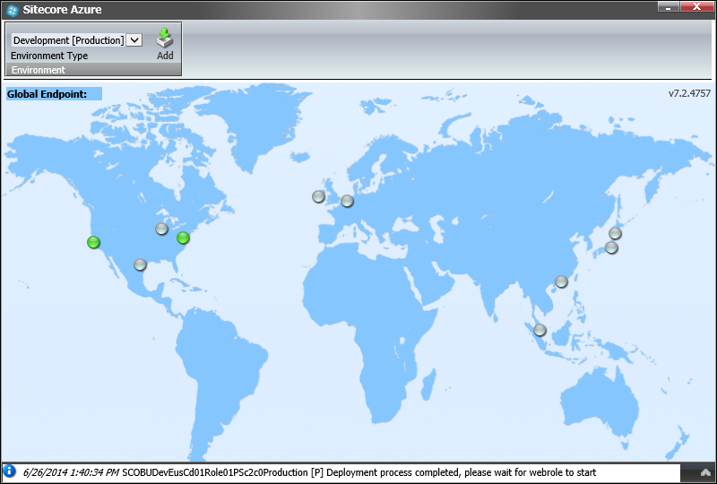
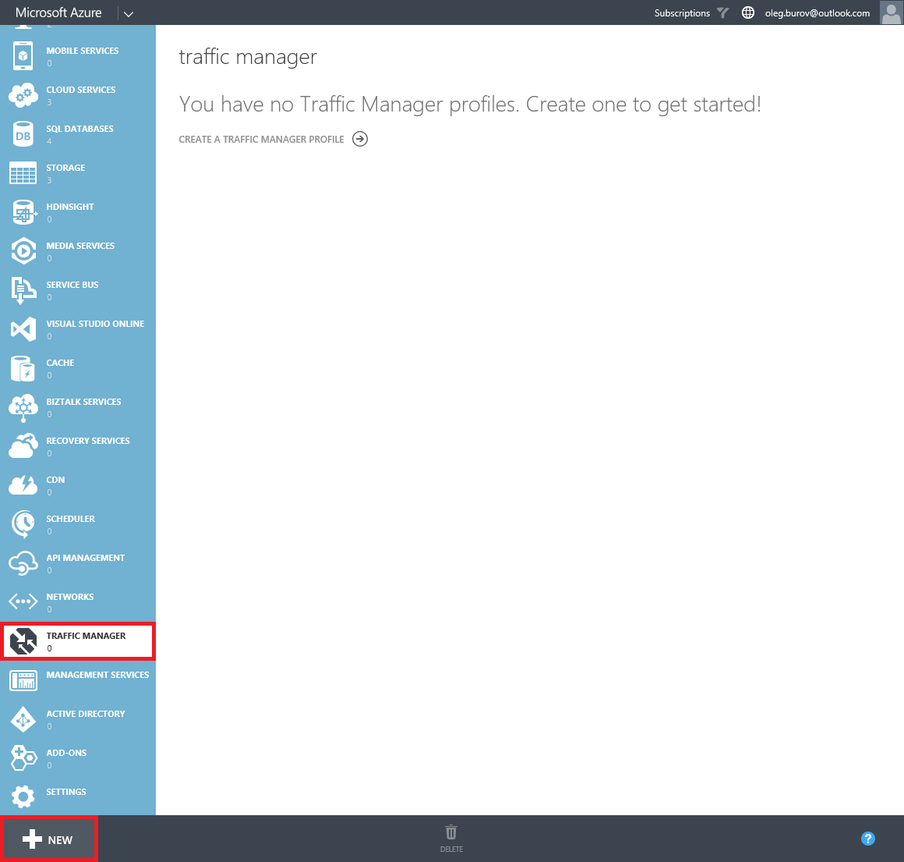
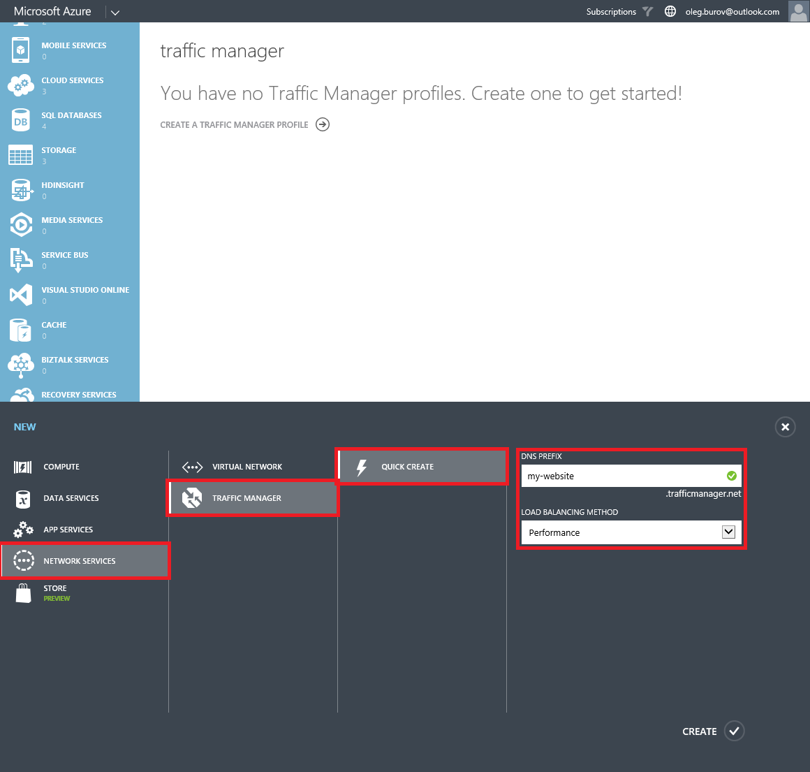
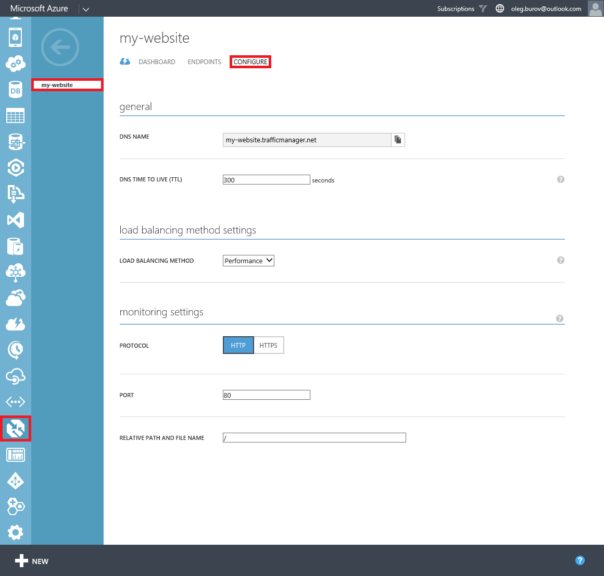
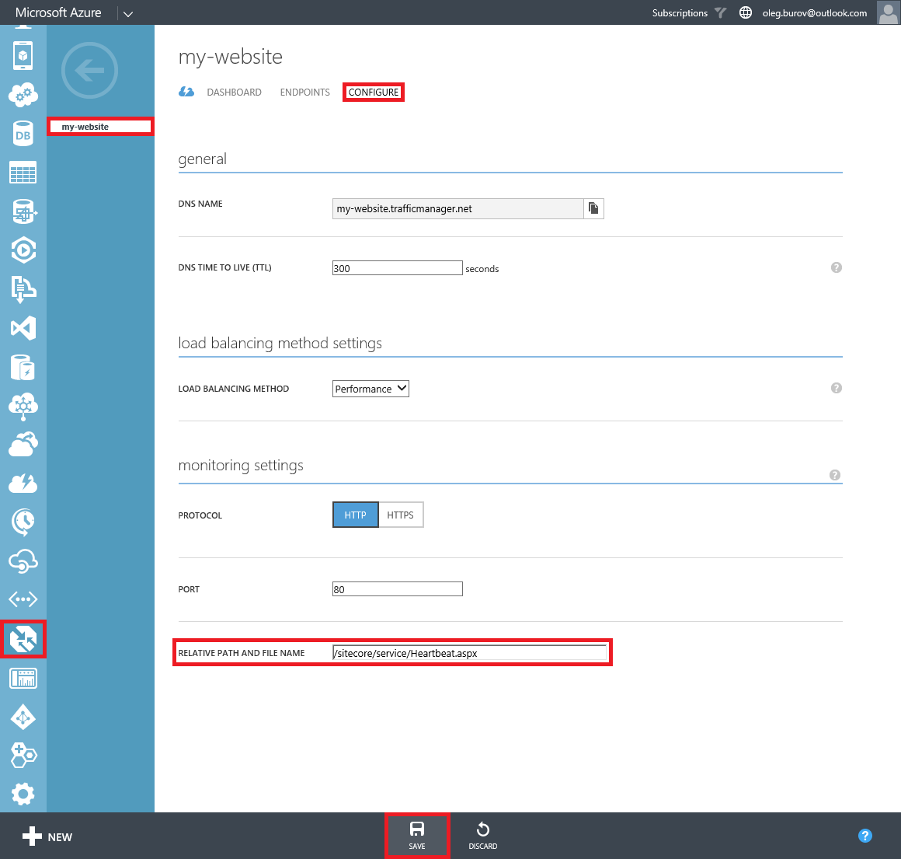
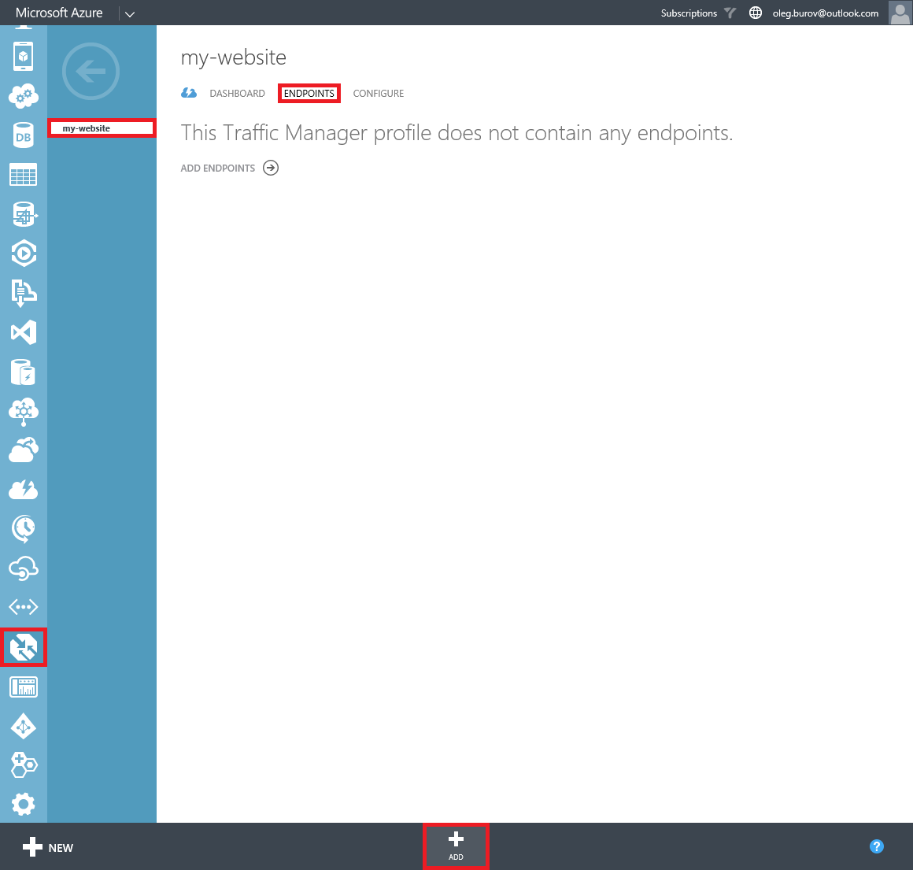
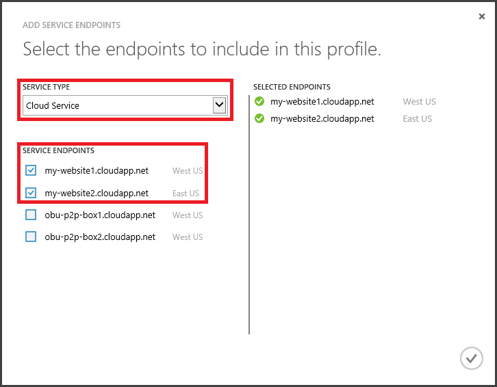
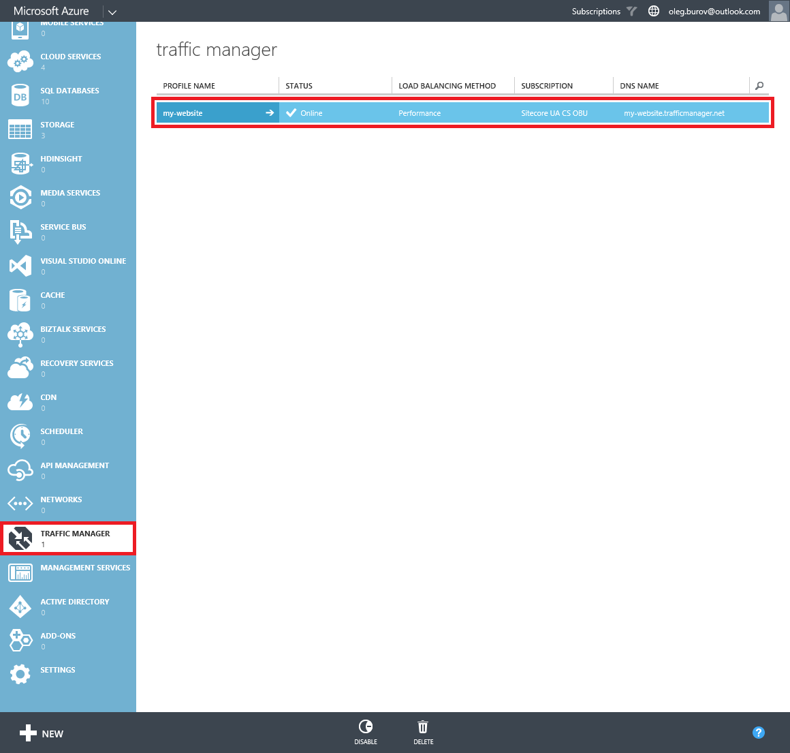

#How to use a custom Azure Traffic Manager Service in Sitecore Azure

The Sitecore Azure module automatically creates all Microsoft Azure services it uses during deployment, as well as generates names for them. The pattern for generating names depends on the project name and environment type from the Sitecore Azure Environment file, as well as the deployment location, deployment type, etc.

One of the services used during deployment is the [Microsoft Azure Traffic Manager](https://msdn.microsoft.com/en-us/library/azure/hh745750.aspx). Microsoft Azure requires that the name of the Microsoft Azure Traffic Manger Service is unique, since it is used as a part of the public URL prefix for the `*.trafficmanager.net` host name.

This article provides a list of techniques that can be used to manually create the Microsoft Azure Traffic Manager and deploy a Sitecore solution using this Traffic Manager Service when using the Sitecore Azure module.

##Solution

The recommended approach to use a custom Azure Storage Service in Sitecore Azure is as follows:

1. Modify the `\Website\App_Config\Include\Sitecore.Azure.config` file under the `settings` element. Switch the `Azure.TrafficManager.Enable` setting to the `false` value.

   ```xml
   <setting name="Azure.TrafficManager.Enable" value="false" />
   ```

2. In the **Sitecore Azure** application, deploy a Sitecore solution in different datacenters across the world or in one, depending on the Load Balancing method you need to use.

   
   
3. Log in to the **Microsoft Azure Management Portal** using the https://manage.windowsazure.com URL.

4. In the **Traffic Manager** section, click the **New** button.

   

5. Create a custom traffic manager profile (Network Services -> Traffic Manager -> Quick Create).

   
   
6. Select the created traffic manager entry and switch to the **Configure** tab.

   
   
7. Set the **Relative Path and File Name** field to the `/sitecore/service/Heartbeat.aspx` URL and save changes.

   
   
8. Switch to the **Endpoints** tab and click the **Add** button.

   
   
9. In the **Add Service Endpoints** dialog, in **Service Type**, select the **Cloud Service** option and check service endpoints that represent Cloud Services with Sitecore solutions.

   

10. Once the traffic manager profile checks the endpoints, it becomes online and ready to control the distribution of the visitors traffic to the Sitecore solution.

   